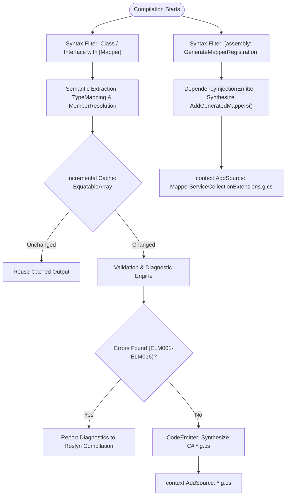
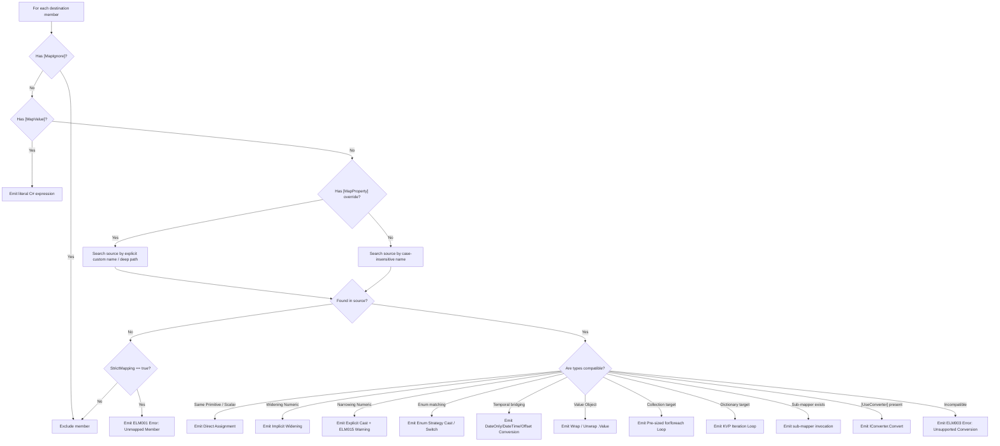

# EricksonLopez.Mapper

High-performance, compile-time, reflection-free, Native AOT-first Object Mapping ecosystem built on Roslyn Incremental Source Generators for modern .NET.

[](https://github.com/ericksonlopezf/dotnet-mapper/actions)
[](https://codecov.io/gh/ericksonlopezf/dotnet-mapper)
[](https://sonarcloud.io/summary/new_code?id=ericksonlopezf_dotnet-mapper)
[](https://github.com/ericksonlopezf/dotnet-mapper/blob/main/docs/quality-gates.md)
[](https://www.nuget.org/packages/EricksonLopez.Mapper)
[](https://www.nuget.org/packages/EricksonLopez.Mapper)
[](https://github.com/ericksonlopezf/dotnet-mapper/blob/main/LICENSE)
[](https://dotnet.microsoft.com)
[](https://learn.microsoft.com/en-us/dotnet/core/deploying/native-aot)

`EricksonLopez.Mapper` is an enterprise-grade, compile-time Object Mapping ecosystem for **.NET 8**, **.NET 9**, and **.NET 10**. Powered exclusively by **Roslyn Incremental Source Generators**, it synthesizes strongly-typed, reflection-free C# mapping code directly during compilation. It completely eliminates runtime reflection (`System.Reflection`), dynamic IL emission, and startup lookup penalties while offering native first-class support for Domain-Driven Design (DDD) Value Objects, Strongly Typed IDs, static domain factories (`[MapFactory]`), modern immutable collections, and strict compile-time error diagnostics.

---

## Table of Contents

- [What Problem It Solves](#-what-problem-it-solves)
- [Key Features](#-key-features)
- [Ecosystem](#-ecosystem)
- [Documentation](#-documentation)
  - [Step-by-Step Interactive Showcase (Levels 00 to 10)](#-step-by-step-interactive-showcase-levels-00-to-10)
  - [Technical Reference & Architecture Guides](#-technical-reference--architecture-guides)
- [Installation](#-installation)
- [Quick Start](#-quick-start)
- [Core Use Cases](#-core-use-cases)
- [Configuration & Integrations](#-configuration--integrations)
  - [Dependency Injection & Assembly Scanning](#dependency-injection--assembly-scanning)
  - [Assembly-Wide Defaults](#assembly-wide-defaults)
  - [Functional Result Pattern Integration](#functional-result-pattern-integration)
  - [DDD Domain Primitives Integration](#ddd-domain-primitives-integration)
  - [Mapster Interoperability Bridge](#mapster-interoperability-bridge)
  - [Roslyn Diagnostic Analyzers & Code Fixes](#roslyn-diagnostic-analyzers--code-fixes)
- [Testing & Quality](#-testing--quality)
- [Performance Benchmarks](#-performance-benchmarks)
- [Compatibility & Technical Matrix](#-compatibility--technical-matrix)
- [Architecture & Design Principles](#-architecture--design-principles)
- [Best Practices & Anti-Patterns](#-best-practices--anti-patterns)
- [Troubleshooting & Common Pitfalls](#-troubleshooting--common-pitfalls)
- [Part of the EricksonLopez Ecosystem](#-part-of-the-ericksonlopez-ecosystem)
- [Contributing](#-contributing)
- [License](#-license)

---

## 🎯 What Problem It Solves

### The Traditional Mapping Pitfalls

1. **The Hidden Cost of Runtime Reflection & Dynamic IL**: Legacy mapping frameworks (such as AutoMapper and default Mapster modes) rely on runtime reflection, dynamic expression tree compilation, and global lookup dictionaries. This incurs measurable JIT warm-up pauses, continuous boxing allocations, and high latency overhead—running up to **8.55× slower** than handwritten C#.
2. **Incompatibility with Native AOT & IL Trimming**: Cloud-native architectures increasingly mandate Ahead-of-Time compilation (`PublishAot=true`) and aggressive tree trimming (`PublishTrimmed=true`). Runtime reflection and dynamic code emission trigger fatal trim warnings (`IL2026`, `IL3050`) or crash unpredictably in production when required metadata or parameterless constructors are stripped.
3. **Domain-Driven Design (DDD) Invariant Violations**: Conventional mappers frequently bypass encapsulation by using uninitialized object allocation (`FormatterServices.GetUninitializedObject`) or mutating existing entity instances in-place (`Map(source, target)`). This invalidates domain invariants, bypasses business validation rules, breaks value objects, and creates race conditions in concurrent pipelines.
4. **Silent Runtime Mapping Failures**: Permissive mapping defaults silently ignore unmapped, renamed, or nullability-mismatched properties. Bugs that should be caught at build time surface weeks later as production `NullReferenceException` crashes or corrupted persistence models.

### How EricksonLopez.Mapper Solves This

- **100% Compile-Time Synthesis**: Synthesizes pure, readable C# code directly into `*.g.cs` files during compilation. Zero runtime reflection, zero dynamic dispatch, and identical performance to hand-optimized assignments (**2.80 ns** physical minimum).
- **Native AOT & Trimming-First Architecture**: 100% verified with `PublishAot=true` and `PublishTrimmed=true`. Generates zero trim warnings and requires no runtime code emission.
- **DDD & Invariant Safety**: Enforces domain boundaries through first-class static factory methods (`[MapFactory]`), automatic wrap/unwrap for `[ValueObject]` and `IStrongId`, and strict constructor parameter matching.
- **Strict-by-Default Compilation Gate**: Every unmapped destination property, nullability mismatch, ambiguous constructor, or cyclic reference fails compilation immediately via diagnostic codes (`ELM001`–`ELM016`) equipped with automated Roslyn CodeFix providers.

---

## ⚡ Key Features

- ⚡ **Physical Minimum Latency (2.80 ns)**: Emitted mapping code executes at the theoretical physical minimum, matching manual hand-optimized C# assignments with 0 B overhead.
- 🛡️ **Zero Reflection Invariant**: Strictly prohibited from using `System.Reflection`, `Activator`, `Marshal`, or `dynamic` at runtime and compile-time, enforced by Roslyn Analyzer `ELM008`/`ELM009`.
- 🌲 **NativeAOT & IL Trimming Native**: Designed from inception for `PublishAot=true` and `PublishTrimmed=true`, generating zero trim or dynamic code warnings (`IL2026`, `IL3050`).
- 🧱 **First-Class Domain-Driven Design Support**: Built-in wrap/unwrap for `[ValueObject]` and `IStrongId`, factory method dispatch via `[MapFactory]`, and immutability preservation.
- 🚦 **Strict-by-Default Diagnostic Engine**: Emits immediate compile-time errors (`ELM001`–`ELM016`) for unmapped properties, nullability mismatches, and cycles, with automated Roslyn CodeFixes.
- 📦 **Zero-Allocation Modern Collections**: Pre-sized loops and native support for `ImmutableArray<T>`, `ImmutableList<T>`, `FrozenSet<T>`, `FrozenDictionary<K,V>`, and spans.
- 🔌 **Seamless DI & Ecosystem Integration**: Optional assembly-level DI code generation via `[assembly: GenerateMapperRegistration]`, plus official extensions for `Result<T>`, `DomainPrimitives`, and `Mapster`.

---

## 📦 Ecosystem

`EricksonLopez.Mapper` is distributed as a suite of 7 specialized NuGet packages:

| Package | Version | Description |
|---|---|---|
| [`EricksonLopez.Mapper`](https://www.nuget.org/packages/EricksonLopez.Mapper) | [](https://www.nuget.org/packages/EricksonLopez.Mapper) | Umbrella metapackage referencing Abstractions (runtime) and Generator (build-time analyzer) |
| [`EricksonLopez.Mapper.Abstractions`](https://www.nuget.org/packages/EricksonLopez.Mapper.Abstractions) | [](https://www.nuget.org/packages/EricksonLopez.Mapper.Abstractions) | Core declarative attributes (`[Mapper]`, `[MapProperty]`, `[MapValue]`, etc.) and `IConverter<S, D>` |
| [`EricksonLopez.Mapper.DomainPrimitives`](https://www.nuget.org/packages/EricksonLopez.Mapper.DomainPrimitives) | [](https://www.nuget.org/packages/EricksonLopez.Mapper.DomainPrimitives) | Pre-built converters for DDD `IDomainPrimitive<TSelf, TValue>` and `IStrongId<TSelf, TValue>` |
| [`EricksonLopez.Mapper.Result`](https://www.nuget.org/packages/EricksonLopez.Mapper.Result) | [](https://www.nuget.org/packages/EricksonLopez.Mapper.Result) | Railway-Oriented Programming functional projection extensions (`Map`, `MapAsync`, `MapList`) for `Result<T>` |
| [`EricksonLopez.Mapper.Mapster`](https://www.nuget.org/packages/EricksonLopez.Mapper.Mapster) | [](https://www.nuget.org/packages/EricksonLopez.Mapper.Mapster) | Bi-directional adapter bridge between `IConverter<S, D>` and Mapster `TypeAdapterConfig` |
| [`EricksonLopez.Mapper.Generator`](https://www.nuget.org/packages/EricksonLopez.Mapper.Generator) | [](https://www.nuget.org/packages/EricksonLopez.Mapper.Generator) | Roslyn Incremental Source Generator synthesizing C# mapping code at build time |
| [`EricksonLopez.Mapper.Analyzers`](https://www.nuget.org/packages/EricksonLopez.Mapper.Analyzers) | [](https://www.nuget.org/packages/EricksonLopez.Mapper.Analyzers) | Roslyn Diagnostic Analyzers (`ELM008`, `ELM009`, `ELM012`) and automated CodeFix providers |

---

## 📚 Documentation

> 🌐 **Official Documentation Hub:** [https://github.com/ericksonlopezf/dotnet-mapper/tree/main/docs](https://github.com/ericksonlopezf/dotnet-mapper/tree/main/docs)

### 🎓 Step-by-Step Interactive Showcase (Levels 00 to 10)

The repository includes a fully compilable, progressive 11-level showcase project under [`sample/EricksonLopez.Mapper.Sample`](https://github.com/ericksonlopezf/dotnet-mapper/tree/main/sample/EricksonLopez.Mapper.Sample):

| Level | Topic | Description | Source File |
|---|---|---|---|
| [**Level 00**](https://github.com/ericksonlopezf/dotnet-mapper/blob/main/sample/EricksonLopez.Mapper.Sample/Level0_Conceptual/ConceptualOverview.cs) | **Architecture & Philosophy** | Conceptual foundations, compile-time Roslyn pipeline, and Native AOT rationale | [`ConceptualOverview.cs`](https://github.com/ericksonlopezf/dotnet-mapper/blob/main/sample/EricksonLopez.Mapper.Sample/Level0_Conceptual/ConceptualOverview.cs) |
| [**Level 01**](https://github.com/ericksonlopezf/dotnet-mapper/blob/main/sample/EricksonLopez.Mapper.Sample/Level1_QuickStart/QuickStartDemo.cs) | **Getting Started & Primitives** | Installation, minimal setup, and convention-based partial method mapping | [`QuickStartDemo.cs`](https://github.com/ericksonlopezf/dotnet-mapper/blob/main/sample/EricksonLopez.Mapper.Sample/Level1_QuickStart/QuickStartDemo.cs) |
| [**Level 02**](https://github.com/ericksonlopezf/dotnet-mapper/blob/main/sample/EricksonLopez.Mapper.Sample/Level2_Configuration/ConfigurationDemo.cs) | **Configuration Attributes** | `[MapProperty]`, `[MapIgnore]`, `[MapNullFallback]`, `[ValueObject]`, `[MapValue]`, `[EnumMappingStrategy]` | [`ConfigurationDemo.cs`](https://github.com/ericksonlopezf/dotnet-mapper/blob/main/sample/EricksonLopez.Mapper.Sample/Level2_Configuration/ConfigurationDemo.cs) |
| [**Level 03**](https://github.com/ericksonlopezf/dotnet-mapper/blob/main/sample/EricksonLopez.Mapper.Sample/Level3_RealWorld/RealWorldDemo.cs) | **Real-World Scenarios** | Nested object hierarchies, collections (`ImmutableArray`, `FrozenSet`), and built-in type conversions | [`RealWorldDemo.cs`](https://github.com/ericksonlopezf/dotnet-mapper/blob/main/sample/EricksonLopez.Mapper.Sample/Level3_RealWorld/RealWorldDemo.cs) |
| [**Level 04**](https://github.com/ericksonlopezf/dotnet-mapper/blob/main/sample/EricksonLopez.Mapper.Sample/Level4_Advanced/AdvancedDemo.cs) | **Advanced Integration** | Positional records, factory methods (`[MapFactory]`), and polymorphic dispatch (`[MapDerivedType]`) | [`AdvancedDemo.cs`](https://github.com/ericksonlopezf/dotnet-mapper/blob/main/sample/EricksonLopez.Mapper.Sample/Level4_Advanced/AdvancedDemo.cs) |
| [**Level 05**](https://github.com/ericksonlopezf/dotnet-mapper/blob/main/sample/EricksonLopez.Mapper.Sample/Level5_Processing/ProcessingDemo.cs) | **Parallel & Batch Processing** | Stateless thread safety, parallel batch processing, and PLINQ execution | [`ProcessingDemo.cs`](https://github.com/ericksonlopezf/dotnet-mapper/blob/main/sample/EricksonLopez.Mapper.Sample/Level5_Processing/ProcessingDemo.cs) |
| [**Level 06**](https://github.com/ericksonlopezf/dotnet-mapper/blob/main/sample/EricksonLopez.Mapper.Sample/Level6_ErrorHandling/ErrorHandlingDemo.cs) | **Error Boundaries** | Custom converter exception boundaries, fallback strategies, and defensive transformations | [`ErrorHandlingDemo.cs`](https://github.com/ericksonlopezf/dotnet-mapper/blob/main/sample/EricksonLopez.Mapper.Sample/Level6_ErrorHandling/ErrorHandlingDemo.cs) |
| [**Level 07**](https://github.com/ericksonlopezf/dotnet-mapper/blob/main/sample/EricksonLopez.Mapper.Sample/Level7_Scalability/ScalabilityDemo.cs) | **Throughput & Scalability** | High-throughput in-memory benchmarks sustaining 30M+ mappings/sec | [`ScalabilityDemo.cs`](https://github.com/ericksonlopezf/dotnet-mapper/blob/main/sample/EricksonLopez.Mapper.Sample/Level7_Scalability/ScalabilityDemo.cs) |
| [**Level 08**](https://github.com/ericksonlopezf/dotnet-mapper/blob/main/sample/EricksonLopez.Mapper.Sample/Level8_Customization/CustomizationDemo.cs) | **Custom Converters** | `IConverter<S, D>`, `[UseConverter(Type)]`, and DI-injected converter fields (`[UseConverter(FieldName)]`) | [`CustomizationDemo.cs`](https://github.com/ericksonlopezf/dotnet-mapper/blob/main/sample/EricksonLopez.Mapper.Sample/Level8_Customization/CustomizationDemo.cs) |
| [**Level 09**](https://github.com/ericksonlopezf/dotnet-mapper/blob/main/sample/EricksonLopez.Mapper.Sample/Level9_Extensions/ExtensionsDemo.cs) | **Ecosystem Extensions** | `AddGeneratedMappers()`, `DomainPrimitives`, `Result` monad, and `Mapster` bridge | [`ExtensionsDemo.cs`](https://github.com/ericksonlopezf/dotnet-mapper/blob/main/sample/EricksonLopez.Mapper.Sample/Level9_Extensions/ExtensionsDemo.cs) |
| [**Level 10**](https://github.com/ericksonlopezf/dotnet-mapper/blob/main/sample/EricksonLopez.Mapper.Sample/Level10_Architecture/ArchitectureDemo.cs) | **Clean Architecture & DDD** | Strict boundary enforcement, DTO projections, and `[MapIgnoreSource]` for domain models | [`ArchitectureDemo.cs`](https://github.com/ericksonlopezf/dotnet-mapper/blob/main/sample/EricksonLopez.Mapper.Sample/Level10_Architecture/ArchitectureDemo.cs) |

### 📖 Technical Reference & Architecture Guides

- [**Architecture & Pipeline**](https://github.com/ericksonlopezf/dotnet-mapper/blob/main/docs/architecture.md) — Internal architecture, Roslyn 7-module generator engine, and construction resolution.
- [**Architectural Decision Records (ADRs)**](https://github.com/ericksonlopezf/dotnet-mapper/tree/main/docs/adr) — 34 ADRs documenting architecture rationale (`ADR-000` to `ADR-021`) and permanent non-goals (`ADR-D01` to `ADR-D12`).
- [**Design Decisions Summary**](https://github.com/ericksonlopezf/dotnet-mapper/blob/main/docs/design-decisions.md) — Consolidated summary of all architectural decision records.
- [**Technical Audit Report**](https://github.com/ericksonlopezf/dotnet-mapper/blob/main/docs/audit-report.md) — Comprehensive technical audit, guarantees, and verification records.
- [**Competitive Audit & Positioning**](https://github.com/ericksonlopezf/dotnet-mapper/blob/main/docs/competitive-audit.md) — In-depth benchmark and feature comparison vs Riok.Mapperly, Mapster, and AutoMapper.
- [**Master Feature Matrix**](https://github.com/ericksonlopezf/dotnet-mapper/blob/main/docs/master-feature-matrix.md) — Complete feature status, classification, and AOT/reflection compliance matrix.
- [**Cookbook & Practical Recipes**](https://github.com/ericksonlopezf/dotnet-mapper/blob/main/docs/cookbook.md) — 28 production-ready recipes covering simple mappings to complex domain pipelines.
- [**API Reference**](https://github.com/ericksonlopezf/dotnet-mapper/blob/main/docs/api-reference.md) — Detailed specifications for all public attributes, interfaces, and extension methods.
- [**API Public Inventory**](https://github.com/ericksonlopezf/dotnet-mapper/blob/main/docs/api-inventory.md) — Complete catalog of public types, signatures, and breaking change rules.
- [**Benchmark Results & Methodology**](https://github.com/ericksonlopezf/dotnet-mapper/blob/main/docs/benchmark-results.md) — BenchmarkDotNet methodology, execution instructions, and reproducible data.
- [**Quality Gates & Code Analysis**](https://github.com/ericksonlopezf/dotnet-mapper/blob/main/docs/quality-gates.md) — Mutation testing thresholds, Roslyn diagnostic layers, and NativeAOT validation.
- [**Troubleshooting & FAQ**](https://github.com/ericksonlopezf/dotnet-mapper/blob/main/docs/troubleshooting.md) — Solutions for common compilation issues (`ELM001`–`ELM016`, CS8795, emitting files).
- [**Migration Guide**](https://github.com/ericksonlopezf/dotnet-mapper/blob/main/docs/migration-guide.md) — Step-by-step migration guide from AutoMapper and Mapster to EricksonLopez.Mapper.

---

## 📥 Installation

Install the main umbrella metapackage into your application or library project:

### 1. Core Package (Required)

```bash
# Umbrella package (Includes Abstractions and Roslyn Source Generator)
dotnet add package EricksonLopez.Mapper
```

### 2. Optional Framework & Domain Extensions

```bash
# DDD Domain Primitives converters (IDomainPrimitive, IStrongId)
dotnet add package EricksonLopez.Mapper.DomainPrimitives

# Functional Railway-Oriented Programming Result<T> extensions
dotnet add package EricksonLopez.Mapper.Result

# Bi-directional Mapster adapter bridge
dotnet add package EricksonLopez.Mapper.Mapster
```

### 3. Specialized Abstractions & Diagnostic Analyzers

```bash
# Standalone attributes and IConverter interface (for domain/contracts projects)
dotnet add package EricksonLopez.Mapper.Abstractions

# Roslyn Diagnostic Analyzers and automated CodeFix providers (ELM008, ELM009, ELM012)
dotnet add package EricksonLopez.Mapper.Analyzers
```

---

## 🚀 Quick Start

### 1. By-Convention Mapping & Deep Property Flattening

Define a `partial class` annotated with `[Mapper]`. The source generator synthesizes the method implementation at compile time:

```csharp
using EricksonLopez.Mapper;

public class Order
{
    public Guid Id { get; set; }
    public Customer Customer { get; set; } = new();
    public decimal TotalAmount { get; set; }
}

public class Customer
{
    public Address Address { get; set; } = new();
}

public class Address
{
    public string City { get; set; } = string.Empty;
}

public class OrderSummaryDto
{
    public Guid Id { get; set; }
    public string City { get; set; } = string.Empty;
    public decimal Amount { get; set; }
}

[Mapper]
public partial class OrderMapper
{
    [MapProperty("Customer.Address.City", nameof(OrderSummaryDto.City))]
    [MapProperty(nameof(Order.TotalAmount), nameof(OrderSummaryDto.Amount))]
    public partial OrderSummaryDto ToDto(Order source);
}
```

**Usage:**
```csharp
var mapper = new OrderMapper();
OrderSummaryDto dto = mapper.ToDto(order);
```

---

### 2. DDD Value Objects & Strongly Typed IDs

Map directly between Strongly Typed IDs / Value Objects and their underlying primitive types without custom converters:

```csharp
using EricksonLopez.Mapper;

[ValueObject]
public readonly record struct CustomerId(Guid Value);

[ValueObject]
public readonly record struct Money(decimal Amount);

public record CustomerEntity(CustomerId Id, string Name, Money Balance);
public record CustomerDto(Guid Id, string Name, decimal Balance);

[Mapper]
public partial class CustomerMapper
{
    // Automatically unwraps CustomerId.Value -> Guid and Money.Amount -> decimal
    public partial CustomerDto ToDto(CustomerEntity source);

    // Automatically wraps Guid -> CustomerId and decimal -> Money
    public partial CustomerEntity ToEntity(CustomerDto source);
}
```

---

### 3. Factory Method Construction & Invariant Safety

Instantiate rich domain entities with private constructors and validation logic using `[MapFactory]`:

```csharp
using EricksonLopez.Mapper;

public class AccountEntity
{
    public Guid Id { get; }
    public string Owner { get; }
    public decimal Balance { get; }

    private AccountEntity(Guid id, string owner, decimal balance)
    {
        Id = id;
        Owner = owner;
        Balance = balance;
    }

    public static AccountEntity Create(Guid id, string owner, decimal balance)
    {
        if (balance < 0) throw new ArgumentOutOfRangeException(nameof(balance), "Negative balance disallowed.");
        return new AccountEntity(id, owner, balance);
    }
}

public record CreateAccountRequest(Guid Id, string Owner, decimal Balance);

[Mapper]
public partial class AccountMapper
{
    [MapFactory("Create")]
    public partial AccountEntity MapToEntity(CreateAccountRequest request);
}
```

---

### 4. Enum Mapping Strategies & Explicit Member Overrides

Control enum matching semantics by name, by value, or with explicit member-by-member overrides:

```csharp
using EricksonLopez.Mapper;

public enum OrderState { Created, Processing, Dispatched, Cancelled }
public enum OrderStatusDto { New, InProgress, Shipped, Voided }

[Mapper]
public partial class StatusMapper
{
    [EnumMappingStrategy(EnumMappingStrategy.ByName, IgnoreCase = true)]
    [MapEnumValue(OrderState.Created, OrderStatusDto.New)]
    [MapEnumValue(OrderState.Processing, OrderStatusDto.InProgress)]
    [MapEnumValue(OrderState.Dispatched, OrderStatusDto.Shipped)]
    [MapEnumValue(OrderState.Cancelled, OrderStatusDto.Voided)]
    public partial OrderStatusDto MapStatus(OrderState source);
}
```

---

### 5. Injected Constant & Computed Values

Inject literal C# expressions or compile-time constants into destination properties using `[MapValue]`:

```csharp
using EricksonLopez.Mapper;

public class AuditRecord
{
    public Guid EntityId { get; set; }
    public string Operation { get; set; } = string.Empty;
    public DateTime Timestamp { get; set; }
    public string Environment { get; set; } = string.Empty;
}

[Mapper]
public partial class AuditMapper
{
    [MapValue(nameof(AuditRecord.Timestamp), "System.DateTime.UtcNow")]
    [MapValue(nameof(AuditRecord.Environment), "\"Production\"")]
    public partial AuditRecord ToAuditRecord(Order order, string operation);
}
```

---

## 💡 Core Use Cases

### Use Case 1: Clean Architecture / CQRS Handlers

Translate input DTOs into domain commands and aggregate roots into clean response view models inside MediatR / Mediator command and query handlers:

```csharp
public sealed class CreateProductCommandHandler : IRequestHandler<CreateProductCommand, ProductResponseDto>
{
    private readonly ProductMapper _mapper;
    private readonly IProductRepository _repository;

    public CreateProductCommandHandler(ProductMapper mapper, IProductRepository repository)
    {
        _mapper = mapper;
        _repository = repository;
    }

    public async Task<ProductResponseDto> Handle(CreateProductCommand command, CancellationToken ct)
    {
        Product product = _mapper.ToDomain(command);
        await _repository.SaveAsync(product, ct);
        return _mapper.ToResponseDto(product);
    }
}
```

---

### Use Case 2: Multi-Step Domain Aggregate Reconstitution

Reconstitute complex domain aggregates containing child entity collections and strongly typed identities without bypassing private constructor invariants:

```csharp
public class OrderAggregate
{
    public OrderId Id { get; }
    public CustomerId CustomerId { get; }
    public ImmutableArray<OrderLine> Lines { get; }

    private OrderAggregate(OrderId id, CustomerId customerId, ImmutableArray<OrderLine> lines)
    {
        Id = id;
        CustomerId = customerId;
        Lines = lines;
    }

    public static OrderAggregate Reconstitute(OrderId id, CustomerId customerId, ImmutableArray<OrderLine> lines)
        => new(id, customerId, lines);
}

[Mapper]
public partial class OrderReconstitutionMapper
{
    [MapFactory("Reconstitute")]
    public partial OrderAggregate Reconstitute(OrderPersistenceModel model);
    public partial OrderLine MapLine(OrderLineModel lineModel);
}
```

---

### Use Case 3: High-Throughput Batch Processing & PLINQ Pipelines

Leverage `static partial class` mappers for zero-allocation, thread-safe parallel processing across massive collections without DI container locks or delegate heap allocations:

```csharp
[Mapper]
public static partial class TelemetryDataMapper
{
    public static partial MetricTelemetryDto MapMetric(RawSensorReading reading);
}

// Zero-allocation parallel processing pipeline
public List<MetricTelemetryDto> ProcessBatch(IEnumerable<RawSensorReading> readings)
{
    return readings
        .AsParallel()
        .WithDegreeOfParallelism(Environment.ProcessorCount)
        .Select(TelemetryDataMapper.MapMetric)
        .ToList();
}
```

---

### Use Case 4: Entity Framework Core LINQ Projections

Avoid runtime expression tree rewriting bugs and Native AOT compilation traps by using pure C# static mapping methods inside standard EF Core `.Select()` queries:

```csharp
[Mapper]
public static partial class CustomerProjectionMapper
{
    public static partial CustomerSummaryDto ProjectToSummary(Customer customer);
}

// In EF Core query:
public async Task<List<CustomerSummaryDto>> GetSummariesAsync(MyDbContext context, CancellationToken ct)
{
    return await context.Customers
        .AsNoTracking()
        .Select(c => new CustomerSummaryDto
        {
            Id = c.Id,
            FullName = c.FirstName + " " + c.LastName,
            City = c.Address.City
        })
        .ToListAsync(ct);
}
```

---

### Use Case 5: Polymorphic Hierarchy Mapping

Dispatch abstract base types and inheritance hierarchies to concrete DTOs at compile time using pattern-matching switch expressions:

```csharp
public abstract record VehicleEntity(string Vin, decimal BasePrice);
public record CarEntity(string Vin, decimal BasePrice, int PassengerCount) : VehicleEntity(Vin, BasePrice);
public record TruckEntity(string Vin, decimal BasePrice, decimal CargoCapacityTons) : VehicleEntity(Vin, BasePrice);

public abstract record VehicleDto(string Vin, decimal BasePrice);
public record CarDto(string Vin, decimal BasePrice, int PassengerCount) : VehicleDto(Vin, BasePrice);
public record TruckDto(string Vin, decimal BasePrice, decimal CargoCapacityTons) : VehicleDto(Vin, BasePrice);

[Mapper]
public partial class FleetMapper
{
    [MapDerivedType(typeof(CarEntity), typeof(CarDto))]
    [MapDerivedType(typeof(TruckEntity), typeof(TruckDto))]
    public partial VehicleDto MapVehicle(VehicleEntity source);

    public partial CarDto MapCar(CarEntity source);
    public partial TruckDto MapTruck(TruckEntity source);
}
```

---

### Use Case 6: Railway-Oriented Programming (ROP) Result Monad Pipelines

Transform domain entities encapsulated inside `Result<T>` monads seamlessly using functional projection extensions:

```csharp
using EricksonLopez.Mapper.Result;
using EricksonLopez.Result;

public async Task<Result<CustomerDto>> GetCustomerAsync(Guid id, CancellationToken ct)
{
    // Map synchronously or asynchronously across Result<T>, Task<Result<T>>, and ValueTask<Result<T>>
    Task<Result<CustomerEntity>> entityResultTask = _repository.FindByIdAsync(id, ct);
    
    return await entityResultTask.MapAsync(_customerMapper.ToDto);
}
```

---

## 🔌 Configuration & Integrations

### Dependency Injection & Assembly Scanning

Add `[assembly: GenerateMapperRegistration]` to any file in your project (e.g. `Program.cs` or `AssemblyInfo.cs`):

```csharp
using EricksonLopez.Mapper;

[assembly: GenerateMapperRegistration]
```

In your ASP.NET Core `Program.cs`:

```csharp
var builder = WebApplication.CreateBuilder(args);

// Automatically registers all non-static [Mapper] classes as Singletons
// and any [UseConverter(typeof(T))] implementations as Transients
builder.Services.AddGeneratedMappers();
```

---

### Assembly-Wide Defaults

Configure consistent mapping defaults across your entire assembly with `[assembly: MapperDefaults]`:

```csharp
using EricksonLopez.Mapper;

[assembly: MapperDefaults(
    StrictMapping = true,
    EnumMappingStrategy = EnumMappingStrategy.ByName,
    EnumIgnoreCase = true
)]
```

---

### Functional Result Pattern Integration

The `EricksonLopez.Mapper.Result` package provides high-performance extensions for `EricksonLopez.Result`:

```csharp
using EricksonLopez.Mapper.Result;
using EricksonLopez.Result;

Result<Order> orderResult = orderService.GetOrder(id);
Result<OrderDto> dtoResult = orderResult.Map(_mapper.ToDto);

// Asynchronous Task and ValueTask projection
Task<Result<Order>> asyncTask = orderService.GetOrderAsync(id);
Result<OrderDto> asyncDto = await asyncTask.MapAsync(_mapper.ToDto);

// Collection mapping
Result<IEnumerable<Order>> ordersResult = orderService.ListOrders();
Result<IReadOnlyList<OrderDto>> dtosResult = ordersResult.MapList(_mapper.ToDto);
```

---

### DDD Domain Primitives Integration

The `EricksonLopez.Mapper.DomainPrimitives` package integrates directly with `EricksonLopez.DomainPrimitives`:

```csharp
using EricksonLopez.Mapper.DomainPrimitives;

// Built-in converters automatically handle conversions:
var idConverter = new StrongIdToValueConverter<CustomerId, Guid>();
Guid rawGuid = idConverter.Convert(customerId);

var valueToPrimitive = new ValueToDomainPrimitiveConverter<string, EmailAddress>();
EmailAddress email = valueToPrimitive.Convert("dev@ericksonlopez.dev");
```

---

### Mapster Interoperability Bridge

The `EricksonLopez.Mapper.Mapster` package enables seamless interop between `IConverter<S, D>` and Mapster:

```csharp
using EricksonLopez.Mapper.Mapster;
using Mapster;

// 1. Use Mapster inside an IConverter implementation
IConverter<SourceModel, TargetModel> converter = new MapsterConverter<SourceModel, TargetModel>();
TargetModel target = converter.Convert(source);

// 2. Register an EricksonLopez.Mapper IConverter into Mapster's TypeAdapterConfig
var config = new TypeAdapterConfig();
config.UseConverter(new CustomConverterImplementation());
```

---

### Roslyn Diagnostic Analyzers & Code Fixes

`EricksonLopez.Mapper` provides exhaustive compile-time diagnostics enforcing architectural invariants:

| Diagnostic ID | Severity | Category | Description | Automated Code Fix |
|---|---|---|---|---|
| **`ELM001`** | Error | Generator | Unmapped destination member under strict mapping | `[MapIgnore]` / `[MapProperty]` |
| **`ELM002`** | Error | Generator | Destination type has no accessible constructor or factory | — |
| **`ELM003`** | Error | Generator | Unsupported type conversion between source and destination | `[UseConverter]` |
| **`ELM004`** | Error | Generator | Nullable source mapped to non-nullable target | `[MapNullFallback]` |
| **`ELM005`** | Error | Generator | Ambiguous case-insensitive member match | `[MapProperty]` |
| **`ELM006`** | Error | Generator | Destination type lacks accessible constructor or settable properties | — |
| **`ELM007`** | Error | Generator | Ambiguous parameterized constructors | `[MapFactory]` |
| **`ELM008`** | Error | Analyzer | Prohibited reflection API (`System.Reflection`, `Activator`, `Marshal`) | Manual removal |
| **`ELM009`** | Error | Analyzer | Prohibited C# `dynamic` keyword usage | Manual removal |
| **`ELM010`** | Error | Generator | Recursive circular mapping dependency detected | Restructure DTOs |
| **`ELM011`** | Warning | Generator | Abstract base type with potentially uncovered derived types | `[MapDerivedType]` |
| **`ELM012`** | Error | Analyzer | `[Mapper]` class is missing the `partial` modifier | `MakePartialCodeFixProvider` |
| **`ELM013`** | Error | Generator | Type in `[UseConverter]` does not implement `IConverter<S, D>` | — |
| **`ELM014`** | Error / Warn | Generator | Enum member has no destination equivalent in strict mode | `[MapEnumValue]` |
| **`ELM015`** | Warning | Generator | Narrowing numeric conversion potential data loss | Explicit cast |
| **`ELM016`** | Warning | Generator | String-to-enum conversion runtime parsing risk | Typed enums |

---

## 🧪 Testing & Quality

`EricksonLopez.Mapper` enforces continuous verification across multiple defensive testing tiers:

### 1. Deterministic Snapshot Testing (`Verify.Xunit`)
All generated C# code and diagnostic messages are snapshot-tested using `Verify.SourceGenerators` to guarantee zero syntactic regressions and 100% deterministic output across operating systems.

### 2. Living Specifications & Roy Osherove Naming Pattern (ADR-021)
All automated tests adhere strictly to **[ADR-021](https://github.com/ericksonlopezf/dotnet-mapper/blob/main/docs/adr/adr-021-test-naming-convention-and-ide1006.md)** using the canonical three-part pattern:
$$\textbf{UnitOfWork\_StateUnderTest\_ExpectedBehavior}$$

### 3. Mutation Testing Quality Gates (Stryker.NET)
Mutation testing runs across all 7 packages to verify assertion effectiveness:

| Package Scope | Target Mutation Score | Break Threshold (CI Hard Gate) |
|---|:---:|:---:|
| `EricksonLopez.Mapper.Abstractions` | **100%** | **90%** |
| `EricksonLopez.Mapper.Result` | **100%** | **90%** |
| `EricksonLopez.Mapper.DomainPrimitives` | **100%** | **90%** |
| `EricksonLopez.Mapper.Mapster` | **100%** | **90%** |
| `EricksonLopez.Mapper.Analyzers` | **90%** | **75%** |
| `EricksonLopez.Mapper.Generator` | **90%** | **75%** |

### 4. Native AOT CI Smoke Gate
The `aot-smoke-test.yml` workflow executes `dotnet publish -p:PublishAot=true` on Linux with zero warning tolerance (`TreatWarningsAsErrors=true`) and executes the native binary to verify runtime behavior.

---

## ⚡ Performance Benchmarks

> **Benchmark Environment:** .NET 10.0.302 (X64 RyuJIT, AVX-512 enabled), BenchmarkDotNet v0.14.0, Windows 11.
> See [docs/benchmark-results.md](https://github.com/ericksonlopezf/dotnet-mapper/blob/main/docs/benchmark-results.md) for full reproduction instructions.

### 1. Flat Object / Simple POCO Mapping

| Method | Mean Latency | Error | StdDev | Relative Ratio | Heap Allocations |
|---|---|---|---|---|---|
| **EricksonLopez.Mapper (Ours)** | **2.80 ns** | **0.02 ns** | **0.02 ns** | **0.96** | **32 B** |
| **Riok.Mapperly** | **2.80 ns** | **0.03 ns** | **0.03 ns** | **0.96** | **32 B** |
| **Manual Hand-Written (Baseline)** | **2.91 ns** | **0.03 ns** | **0.03 ns** | **1.00** | **32 B** |
| **Mapster** | **8.44 ns** | **0.05 ns** | **0.05 ns** | **2.90** | **32 B** |
| **AutoMapper** | **24.90 ns** | **0.15 ns** | **0.14 ns** | **8.55** | **32 B** |

---

### 2. Value Objects & Strongly Typed IDs

| Method | Mean Latency | Error | StdDev | Relative Ratio | Heap Allocations |
|---|---|---|---|---|---|
| **Manual Hand-Written (Baseline)** | **3.03 ns** | **0.03 ns** | **0.03 ns** | **1.00** | **56 B** |
| **Riok.Mapperly** | **3.15 ns** | **0.04 ns** | **0.04 ns** | **1.04** | **56 B** |
| **EricksonLopez.Mapper (Ours)** | **3.21 ns** | **0.03 ns** | **0.03 ns** | **1.06** | **56 B** |
| **Mapster** | **8.87 ns** | **0.06 ns** | **0.06 ns** | **2.93** | **56 B** |

---

### 3. Polymorphic Inheritance Hierarchy Mapping

| Method | Mean Latency | Error | StdDev | Relative Ratio | Heap Allocations |
|---|---|---|---|---|---|
| **Manual Hand-Written (Baseline)** | **21.35 ns** | **0.18 ns** | **0.17 ns** | **1.00** | **184 B** |
| **EricksonLopez.Mapper (Ours)** | **22.00 ns** | **0.20 ns** | **0.19 ns** | **1.03** | **184 B** |
| **Riok.Mapperly** | **27.57 ns** | **0.25 ns** | **0.24 ns** | **1.29** | **184 B** |

---

## 🌐 Compatibility & Technical Matrix

### 1. Framework Support Matrix

| Package | .NET 8.0 LTS | .NET 9.0 STS | .NET 10.0 | Native AOT | Trimmable | Notes |
|---|:---:|:---:|:---:|:---:|:---:|---|
| **`EricksonLopez.Mapper`** | ✅ | ✅ | ✅ | ✅ | ✅ | Umbrella metapackage |
| **`EricksonLopez.Mapper.Abstractions`** | ✅ | ✅ | ✅ | ✅ | ✅ | Multi-targeted (`netstandard2.0`, `net8/9/10`) |
| **`EricksonLopez.Mapper.DomainPrimitives`** | ✅ | ✅ | ✅ | ✅ | ✅ | Requires .NET 8+ |
| **`EricksonLopez.Mapper.Result`** | ✅ | ✅ | ✅ | ✅ | ✅ | Requires .NET 8+ |
| **`EricksonLopez.Mapper.Mapster`** | ✅ | ✅ | ✅ | ✅ | ✅ | Requires .NET 8+ |
| **`EricksonLopez.Mapper.Generator`** | ✅ | ✅ | ✅ | N/A | N/A | Build-time Roslyn Analyzer (`netstandard2.0`) |
| **`EricksonLopez.Mapper.Analyzers`** | ✅ | ✅ | ✅ | N/A | N/A | Build-time Roslyn Analyzer (`netstandard2.0`) |

---

### 2. Built-in Type Conversion Matrix

| Source Type | Destination Type | Conversion Mechanism | Diagnostic Code |
|---|---|---|---|
| `T` | `T` (Same type) | Direct C# assignment (`dest.Prop = source.Prop;`) | — |
| `int`, `short`, `byte` | `long`, `double`, `int` | Implicit numeric widening | — |
| `long`, `double` | `int`, `float` | Explicit cast (`(int)source.Prop`) | `ELM015` (Warning) |
| `TEnum` | `string` | `.ToString()` | — |
| `string` | `TEnum` | `Enum.Parse<TEnum>(source.Prop)` | `ELM016` (Warning) |
| `SourceEnum` | `TargetEnum` | Name matching / strategy cast | `ELM014` (Strict) |
| `Guid` | `string` / `string` → `Guid` | `.ToString()` / `Guid.Parse(source.Prop)` | — |
| `DateTime` | `DateOnly` / `DateOnly` → `DateTime` | `DateOnly.FromDateTime(src)` / `.ToDateTime(TimeOnly.MinValue)` | — |
| `DateTime` | `DateTimeOffset` | `new DateTimeOffset(src)` | — |
| `[ValueObject]` / `IStrongId` | Primitive (`Guid`, `string`, etc.) | Direct unwrap (`src.Prop.Value`) and wrap (`new VO(src.Prop)`) | — |
| Collections (`T[]`, `List<T>`, `ImmutableArray<T>`, `FrozenSet<T>`) | Pre-sized loop allocation with capacity hint | — |
| `Dictionary<K, V>` | `Dictionary<K, V>`, `FrozenDictionary<K, V>` | Key-value pair iteration loop | — |
| Nested Object | Nested Object DTO | Companion partial method call (`this.MapChild(src.Child)`) | — |
| Any Type | Any Type | `IConverter<S, D>` via `[UseConverter]` | `ELM013` (Validation) |

---

## 🏛️ Architecture & Design Principles

### Core Architectural Invariants

1. **Compile-Time Only**: All mapping logic is synthesized into clean, inspectable `*.g.cs` files during compilation. Zero runtime IL emit, zero dynamic method compilation.
2. **Zero-Reflection Invariant**: Absolute prohibition of `System.Reflection`, `Activator`, `Marshal`, or `dynamic` in runtime packages. Enforced via Roslyn Analyzer `ELM008`/`ELM009`.
3. **Native AOT & Trimming-First**: Zero trim or dynamic code warnings (`IL2026`, `IL3050`).
4. **Strict by Default**: Unmapped destination properties, missing constructors, and cyclic dependencies result in immediate compilation errors (`ELM001`–`ELM016`).
5. **DDD & Invariant Safety**: Domain models with private constructors are instantiated exclusively via factory methods (`[MapFactory]`). Value objects and strongly typed IDs are unwrapped/wrapped natively.

---

### Roslyn Incremental Generator Pipeline



---

### Property Resolution & Conversion Strategy Decision Tree



---

## 🛡️ Best Practices & Anti-Patterns

| Scenario | ❌ Avoid | ✅ Recommended |
|---|---|---|
| **Compilation Strictness** | Disabling strict mapping globally with `StrictMapping = false` | Keeping strict mapping enabled (`StrictMapping = true`) to catch unmapped fields at build time |
| **Attribute Identifiers** | Magic string literals `[MapProperty("CustName", "Name")]` | Refactoring-safe identifiers `[MapProperty(nameof(Source.CustName), nameof(Dest.Name))]` |
| **Default Values** | Creating heavy `IConverter` classes for simple fallback values | Using inlined `[MapNullFallback(nameof(Dest.Price), "0m")]` |
| **Nested Mappers** | Scattering child mapping methods across separate mapper classes | Co-locating nested mapping methods within the same `[Mapper]` class for automatic linking |
| **Polymorphic Mapping** | Omitting derived types leading to runtime dispatch failures | Registering all concrete subtypes explicitly with `[MapDerivedType]` |
| **High-Throughput LINQ** | Instantiating mapper classes inside hot loops or LINQ queries | Using `static partial class` mappers for zero-allocation delegate caching |
| **Custom Converters** | Introducing I/O side effects or mutable state in `IConverter` | Keeping `IConverter<S, D>` implementations pure, stateless, and thread-safe |
| **DDD Value Objects** | Manually configuring explicit mappings for single-value records | Marking value objects with `[ValueObject]` for automatic compile-time wrap/unwrap |
| **Architecture Layering** | Leaking presentation DTOs directly into database entity mappings | Maintaining strict layer separation: `RequestDto -> Command -> Entity -> ResponseDto` |
| **Instance Mutation** | Attempting in-place mutation `Map(source, target)` | Generating clean, new immutable instances to preserve DDD invariants ([ADR-D05](https://github.com/ericksonlopezf/dotnet-mapper/blob/main/docs/adr/adr-d05-no-existing-instance-mapping.md)) |

---

## ⚠️ Troubleshooting & Common Pitfalls

> [!CAUTION]
> **Permanent Architectural Non-Goals**: `EricksonLopez.Mapper` will **never** support:
> - Runtime reflection fallback ([ADR-001](https://github.com/ericksonlopezf/dotnet-mapper/blob/main/docs/adr/adr-001-source-generation-over-reflection.md), [ADR-007](https://github.com/ericksonlopezf/dotnet-mapper/blob/main/docs/adr/adr-007-aot-first-zero-tolerance.md))
> - Private member bypass via reflection / unsafe IL ([ADR-D02](https://github.com/ericksonlopezf/dotnet-mapper/blob/main/docs/adr/adr-d02-no-private-member-bypass.md))
> - Mutating existing instances in-place (`Map(src, dest)`) ([ADR-D05](https://github.com/ericksonlopezf/dotnet-mapper/blob/main/docs/adr/adr-d05-no-existing-instance-mapping.md))
> - Runtime `IQueryable` expression tree rewriting (`ProjectTo<T>`) ([ADR-D11](https://github.com/ericksonlopezf/dotnet-mapper/blob/main/docs/adr/adr-d11-no-iqueryable-projection.md))
> - Generic runtime `IMapper` service facades ([ADR-D12](https://github.com/ericksonlopezf/dotnet-mapper/blob/main/docs/adr/adr-d12-no-imapper-generic-interface.md))

### 1. Compilation Error `ELM001`: Unmapped Destination Member
- **Cause**: A property in the destination type has no matching property name in the source type under strict mode.
- **Solution**: Apply `[MapProperty(nameof(Source.Old), nameof(Dest.New))]` if names differ, `[MapIgnore(nameof(Dest.Prop))]` if the member should be ignored, or `[MapValue(nameof(Dest.Prop), "default")]` to assign a default expression.

### 2. Compiler Error `CS8795`: Partial Method Implementation Missing
- **Cause**: Roslyn Source Generator did not emit code for your partial method.
- **Solution**:
  1. Ensure the containing class is annotated with `[Mapper]`.
  2. Ensure the containing class has the `partial` modifier (check for `ELM012`).
  3. Verify the method signature follows `public partial TDest MethodName(TSource source)`.
  4. Run `dotnet clean && dotnet build` to clear Roslyn incremental compilation caches.

### 3. Inspecting Generated C# Code on Disk
To view physical `*.g.cs` files synthesized by the source generator, enable compiler file emission in your `.csproj`:

```xml
<PropertyGroup>
  <EmitCompilerGeneratedFiles>true</EmitCompilerGeneratedFiles>
  <CompilerGeneratedFilesOutputPath>Generated</CompilerGeneratedFilesOutputPath>
</PropertyGroup>
```

Synthesized files will appear under `obj/Generated/EricksonLopez.Mapper.Generator/`.

### 4. Nullability Mismatches (`ELM004`)
- **Cause**: A nullable source property (`string?`, `int?`) is mapped to a non-nullable target (`string`, `int`).
- **Solution**: Apply `[MapNullFallback(nameof(Dest.Prop), "\"N/A\"")]` or `[MapNullFallback(nameof(Dest.Number), "0")]`.

### 5. Prohibited Reflection & Dynamic Violations (`ELM008`, `ELM009`)
- **Cause**: Using `System.Reflection`, `Activator.CreateInstance`, or the `dynamic` keyword inside mapper classes.
- **Solution**: Remove runtime reflection and dynamic constructs. Use strongly-typed partial methods and concrete C# types.

---

## 🌐 Part of the EricksonLopez Ecosystem

`EricksonLopez.Mapper` is an integral part of the **EricksonLopez Enterprise Architecture Ecosystem**:

- 🧱 [**EricksonLopez.SharedKernel**](https://github.com/ericksonlopezf/dotnet-shared-kernel) — Foundational Domain Primitives, Specifications, and Domain Events.
- ⚡ [**EricksonLopez.Result**](https://github.com/ericksonlopezf/dotnet-result) — High-Performance Struct-Based Result Pattern & Telemetry Ecosystem.
- 🔍 [**EricksonLopez.Specification**](https://github.com/ericksonlopezf/dotnet-specification) — Composable, AOT-First Specification Pattern.
- 📨 [**EricksonLopez.Mediator**](https://github.com/ericksonlopezf/dotnet-mediator) — Zero-Allocation In-Process Mediator & Pipeline Ecosystem.
- 🏢 [**EricksonLopez.MultiTenancy**](https://github.com/ericksonlopezf/dotnet-multitenancy) — Multi-Tenant Isolation, Tenant Context, and PostgreSQL RLS Integration.
- 🛡️ [**EricksonLopez.Resilience**](https://github.com/ericksonlopezf/dotnet-resilience) — Enterprise Resilience Engine with Circuit Breakers & Rate Limiters.
- 💳 [**EricksonLopez.Transaction**](https://github.com/ericksonlopezf/dotnet-transaction) — Distributed Transaction Management & Outbox Pattern.
- 🔁 [**EricksonLopez.Idempotency**](https://github.com/ericksonlopezf/dotnet-idempotency) — Enterprise Idempotency Engine & Distributed Deduplication.

---

## 🤝 Contributing

Contributions, issues, and feature requests are welcome!

### Local Development Setup

1. **Prerequisites**:
   - [.NET 8.0 SDK](https://dotnet.microsoft.com/download/dotnet/8.0), [.NET 9.0 SDK](https://dotnet.microsoft.com/download/dotnet/9.0), [.NET 10.0 SDK](https://dotnet.microsoft.com/download/dotnet/10.0)
   - [PowerShell 7+](https://github.com/PowerShell/PowerShell)

2. **Clone and Build**:
   ```bash
   git clone https://github.com/ericksonlopezf/dotnet-mapper.git
   cd dotnet-mapper
   dotnet build
   ```

3. **Run Automated Test Suite**:
   ```bash
   dotnet test --nologo
   ```

4. **Run Mutation Testing**:
   ```powershell
   pwsh ./run-stryker.ps1
   ```

5. **Run Benchmarks**:
   ```bash
   dotnet run -c Release --project benchmarks/EricksonLopez.Mapper.Benchmarks
   ```

See [CONTRIBUTING.md](https://github.com/ericksonlopezf/dotnet-mapper/blob/main/CONTRIBUTING.md), [CODE_OF_CONDUCT.md](https://github.com/ericksonlopezf/dotnet-mapper/blob/main/CODE_OF_CONDUCT.md), [SECURITY.md](https://github.com/ericksonlopezf/dotnet-mapper/blob/main/SECURITY.md), and [GOVERNANCE.md](https://github.com/ericksonlopezf/dotnet-mapper/blob/main/GOVERNANCE.md) for community guidelines.

---

## 📄 License

Distributed under the [MIT License](https://github.com/ericksonlopezf/dotnet-mapper/blob/main/LICENSE). Copyright © 2026 Erickson Lopez.
