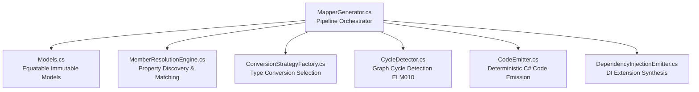
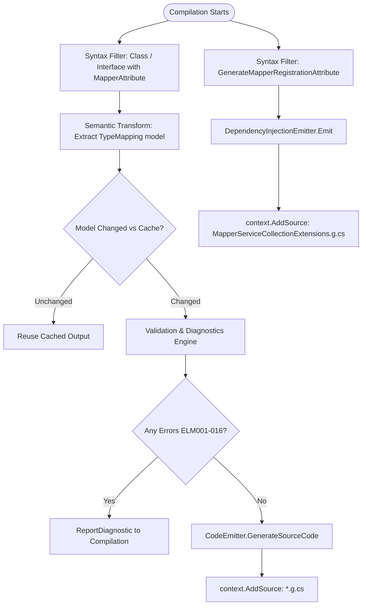

# Architecture & Pipeline

This document details the internal architecture, Roslyn incremental generator pipeline, construction resolution strategies, and diagnostic catalog of `EricksonLopez.Mapper`.

---

## 1. Architectural Components

The ecosystem is partitioned into distinct layers:

| Component | Project | Target Framework(s) | Responsibility |
|---|---|---|---|
| **Abstractions** | `EricksonLopez.Mapper.Abstractions` | `netstandard2.0`, `net8/9/10` | Public declarative attributes (`[Mapper]`, `[MapProperty]`, `[MapValue]`, etc.) and `IConverter<TSource, TDestination>` interface. |
| **Generator** | `EricksonLopez.Mapper.Generator` | `netstandard2.0` | Roslyn `IIncrementalGenerator` synthesizing mapping implementations during compilation. |
| **Analyzers** | `EricksonLopez.Mapper.Analyzers` | `netstandard2.0` | Roslyn `DiagnosticAnalyzer` enforcing AOT invariants (`ELM008`, `ELM009`, `ELM012`) and automated code fix providers. |
| **Umbrella** | `EricksonLopez.Mapper` | `net8.0`, `net9.0`, `net10.0` | Metapackage referencing `Abstractions` (runtime) and `Generator` (as build-time analyzer). |
| **DomainPrimitives** | `EricksonLopez.Mapper.DomainPrimitives` | `net8.0`, `net9.0`, `net10.0` | Extension converters for DDD `IDomainPrimitive` and `IStrongId`. |
| **Mapster** | `EricksonLopez.Mapper.Mapster` | `net8.0`, `net9.0`, `net10.0` | Bi-directional bridge adapter between `IConverter` and Mapster `TypeAdapterConfig`. |
| **Result** | `EricksonLopez.Mapper.Result` | `net8.0`, `net9.0`, `net10.0` | Functional Railway-Oriented Programming projection extensions for `Result<T>`. |

---

## 2. Modular 7-Component Generator Engine

The source generator (`EricksonLopez.Mapper.Generator`) follows strict single-responsibility partitioning:

1. **`MapperGenerator.cs`**: Orchestrates Roslyn's incremental pipeline (`ForAttributeWithMetadataName`), syntax filtering, semantic extraction, and source output registration.
2. **`Models.cs`**: Immutable, value-equatable record models using `EquatableArray<T>` to guarantee Roslyn cache retention without memory leaks.
3. **`MemberResolutionEngine.cs`**: Discovers source and destination properties, handles case-insensitive resolution, processes `[MapProperty]`, `[MapIgnore]`, `[MapIgnoreSource]`, and `[MapperIgnore]`.
4. **`ConversionStrategyFactory.cs`**: Resolves target conversion strategies (direct assignments, narrowing/widening numerics, enums, temporal types, collections, dictionaries, Value Objects, converters, sub-mappers).
5. **`CycleDetector.cs`**: Analyzes directed graph dependencies across nested mapping chains to detect recursion at compile time (`ELM010`).
6. **`CodeEmitter.cs`**: Synthesizes deterministic C# code with null ternary guards, loop structures, and pre-sized collection builders.
7. **`DependencyInjectionEmitter.cs`**: Synthesizes `AddGeneratedMappers(this IServiceCollection)` when `[assembly: GenerateMapperRegistration]` is detected.

---

## 3. Roslyn Incremental Generator Pipeline

---

## 4. Construction Resolution Strategies

When instantiating destination types, the generator applies deterministic selection:

| Strategy | Selection Condition | Emitted Code Pattern |
|---|---|---|
| **ParameterizedConstructor** | Destination type has exactly one accessible constructor with matching parameters | `new DestinationType(source.Prop1, source.Prop2)` |
| **ObjectInitializer** | Destination type has a parameterless constructor and accessible public/init setters | `new DestinationType { Prop1 = source.Prop1, ... }` |
| **FactoryMethod** | Method is annotated with `[MapFactory("FactoryName")]` | `DestinationType.FactoryName(source.Prop1, ...)` |
| **Unsupported** | Multiple ambiguous constructors without `[MapFactory]`, or private constructor | Emits `ELM002`, `ELM006`, or `ELM007` |

---

## 5. Built-in Conversion Strategies

The generator applies the following zero-allocation conversions without requiring manual configuration:

| Conversion Kind | Types Involved | Generated Code Pattern |
|---|---|---|
| **DirectAssignment** | Same primitive / scalar types | `dest.Prop = source.Prop;` |
| **NumericWidening** | e.g. `int` → `long`, `float` → `double` | Implicit C# widening assignment |
| **NumericNarrowing** | e.g. `long` → `int` | `(int)source.Prop` (with `ELM015` warning) |
| **EnumByName** | `SourceEnum` → `TargetEnum` | Direct cast `(TargetEnum)source.Prop` (verified by member name, `ELM014` if unmapped) |
| **EnumByValue** | `SourceEnum` → `TargetEnum` | `(TargetEnum)(int)source.Prop` |
| **EnumToString** | `TEnum` → `string` | `source.Prop.ToString()` |
| **StringToEnum** | `string` → `TEnum` | `Enum.Parse<TEnum>(source.Prop)` (with `ELM016` warning) |
| **GuidToString** | `Guid` ↔ `string` | `source.Prop.ToString()` / `Guid.Parse(source.Prop)` |
| **TemporalDateOnly** | `DateTime` ↔ `DateOnly` | `DateOnly.FromDateTime(src)` / `src.ToDateTime(TimeOnly.MinValue)` |
| **TemporalOffset** | `DateTime` ↔ `DateTimeOffset` | `new DateTimeOffset(src)` / `src.DateTime` |
| **ValueObject** | `[ValueObject]` / single-value record struct | Direct unwrap (`src.Prop.Value`) and wrap (`new ValueObject(src.Prop)`) |
| **Collections** | Arrays, `List<T>`, `ImmutableArray<T>`, etc. | Explicit `for`/`foreach` loops with capacity pre-sizing |
| **Dictionaries** | `Dictionary<K,V>`, `FrozenDictionary<K,V>` | Key-value pair iteration loop |
| **SubMapper** | Nested types mapped by companion partial method | Direct method invocation `this.MapChild(source.Child)` |

---

## 6. Diagnostic Catalog

All diagnostics are categorized into generator errors/warnings and analyzer rules:

### Generator Diagnostics (Build-Time Compilation Gate)

| Diagnostic ID | Severity | Title | Description & Resolution |
|---|---|---|---|
| **`ELM001`** | Error | Unmapped Destination Member | Destination property has no source equivalent in strict mode. Resolve with `[MapProperty]`, `[MapIgnore]`, or `[MapValue]`. |
| **`ELM002`** | Error | Missing Constructor / Factory | Destination type has no accessible public constructor or static factory method. |
| **`ELM003`** | Error | Unsupported Type Conversion | No built-in or custom conversion exists between property types. Resolve via `[UseConverter]`. |
| **`ELM004`** | Error | Nullability Mismatch | Nullable source assigned to non-nullable target. Resolve via `[MapNullFallback]`. |
| **`ELM005`** | Error | Ambiguous Member Match | Multiple source properties match destination name case-insensitively. Resolve via `[MapProperty]`. |
| **`ELM006`** | Error | Missing Supported Constructor | Destination type lacks a parameterless constructor or settable properties. |
| **`ELM007`** | Error | Ambiguous Constructor | Destination type has multiple constructors. Resolve via `[MapFactory]`. |
| **`ELM010`** | Error | Circular Mapping Dependency | Recursive cycle detected across mapping graph. Break cycle by restructuring DTOs. |
| **`ELM011`** | Warning | Incomplete Polymorphic Mapping | Abstract base type lacks complete derived type registrations. |
| **`ELM013`** | Error | Invalid Converter Type | Type specified in `[UseConverter]` does not implement `IConverter<TSource, TDestination>`. |
| **`ELM014`** | Error / Warn | Unmapped Enum Member | Target enum lacks a member present in source enum under strict mapping. |
| **`ELM015`** | Warning | Narrowing Numeric Conversion | Narrowing cast (e.g. `long` → `int`) may cause data truncation. |
| **`ELM016`** | Warning | String to Enum Risk | String-to-enum parsing carries unvalidated runtime parse risks. |

### Analyzer Diagnostics (IDE & CI Gate)

| Diagnostic ID | Severity | Title | Description | Automated Code Fix |
|---|---|---|---|---|
| **`ELM008`** | Error | Prohibited Reflection API | Prohibits `System.Reflection`, `Activator`, `Marshal`, and `RuntimeHelpers` inside mapper classes. | None (Manual removal) |
| **`ELM009`** | Error | Prohibited Dynamic Keyword | Prohibits C# `dynamic` keyword usage inside mapper classes. | None (Manual removal) |
| **`ELM012`** | Error | Mapper Must Be Partial | Class annotated with `[Mapper]` is missing the `partial` modifier. | `MakePartialCodeFixProvider` |

---

## 7. NativeAOT & Trimming Invariants

All emitted mapping code adheres strictly to .NET Ahead-of-Time and Linker trimming rules:
- **Zero Dynamic Code**: No `MakeGenericType`, `MakeGenericMethod`, or `Expression.Compile`.
- **Zero Reflection**: Types and member accesses are emitted as direct C# property lookups.
- **IL Trimmer Friendly**: No `[DynamicDependency]` or reflection-based preservation attributes required.
- **CI Smoke Test Gate**: `aot-smoke-test.yml` executes `dotnet publish -p:PublishAot=true` on Linux with zero warning tolerance.
