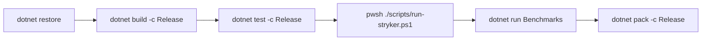

# Build & Development Process

This document details the local build instructions, test execution commands, mutation analysis steps, benchmark execution, and packaging flows for `EricksonLopez.Mapper`.

---

## 1. Local Build Flowchart



---

## 2. Step-by-Step Instructions

### Step 1: Restore Dependencies

Restore NuGet packages across all 17 projects in the solution:

```bash
dotnet restore EricksonLopez.Mapper.slnx
```

> **Central Package Management**: `Directory.Packages.props` centrally locks all package versions.

### Step 2: Build Solution

Compile the entire solution in `Release` configuration:

```bash
dotnet build EricksonLopez.Mapper.slnx -c Release
```

`Directory.Build.props` enforces `WarningsAsErrors=true`, `Nullable=enable`, `LangVersion=14`, `IsAotCompatible=true`, and `IsTrimmable=true`. Building the solution triggers the source generator to emit mapping code across test, benchmark, and sample projects.

### Step 3: Run Full Test Suite

Execute all 8 test projects across all supported target frameworks (`net8.0`, `net9.0`, `net10.0`):

```bash
dotnet test EricksonLopez.Mapper.slnx -c Release
```

| Test Project | Scope | Target Frameworks |
|---|---|---|
| `EricksonLopez.Mapper.Abstractions.Tests` | Core attribute semantics & converter contracts | `net8.0`, `net9.0`, `net10.0` |
| `EricksonLopez.Mapper.Generator.Tests` | Source generator snapshot & behavior tests | `net8.0` |
| `EricksonLopez.Mapper.Analyzers.Tests` | Analyzer diagnostics & code fix verification | `net8.0` |
| `EricksonLopez.Mapper.IntegrationTests` | End-to-end integration tests | `net8.0`, `net9.0`, `net10.0` |
| `EricksonLopez.Mapper.DomainPrimitives.Tests` | DomainPrimitives value object / strong ID tests | `net8.0`, `net9.0`, `net10.0` |
| `EricksonLopez.Mapper.Mapster.Tests` | Mapster adapter bridge tests | `net8.0`, `net9.0`, `net10.0` |
| `EricksonLopez.Mapper.Result.Tests` | Result monad mapping tests | `net8.0`, `net9.0`, `net10.0` |
| `EricksonLopez.Mapper.AotSmokeTest` | NativeAOT execution smoke test | `net8.0`, `net9.0`, `net10.0` |

### Step 4: Run Mutation Testing (Stryker.NET)

Restore local tools and execute mutation testing across packages:

```bash
# Restore local tools (dotnet-stryker v4.16.0)
dotnet tool restore

# Run Stryker for a specific package (e.g. Generator) using the root-level config
dotnet stryker --config-file stryker-generator-config.json

# Or run the multi-project mutation test suite via PowerShell
pwsh ./scripts/run-stryker.ps1
```

> **Config file location:** All 7 Stryker configuration files (`stryker-config.json`, `stryker-abstractions-config.json`, etc.) reside at the **repository root**, not inside `src/` project directories.

### Step 5: Run Performance Benchmarks

To execute BenchmarkDotNet locally against competitor baselines:

```bash
dotnet run --project benchmarks/EricksonLopez.Mapper.Benchmarks -c Release -- --filter "*" --job short
```

### Step 6: Package Creation

Pack all 7 NuGet packages locally:

```bash
dotnet pack EricksonLopez.Mapper.slnx -c Release --output ./nupkgs
```

This produces `.nupkg` and `.snupkg` symbol packages for:
1. `EricksonLopez.Mapper`
2. `EricksonLopez.Mapper.Abstractions`
3. `EricksonLopez.Mapper.Generator`
4. `EricksonLopez.Mapper.Analyzers`
5. `EricksonLopez.Mapper.DomainPrimitives`
6. `EricksonLopez.Mapper.Mapster`
7. `EricksonLopez.Mapper.Result`

---

## 3. Automated CI/CD Pipeline

For full documentation on the 10 automated GitHub Actions workflows, refer to [ci-cd.md](ci-cd.md).
