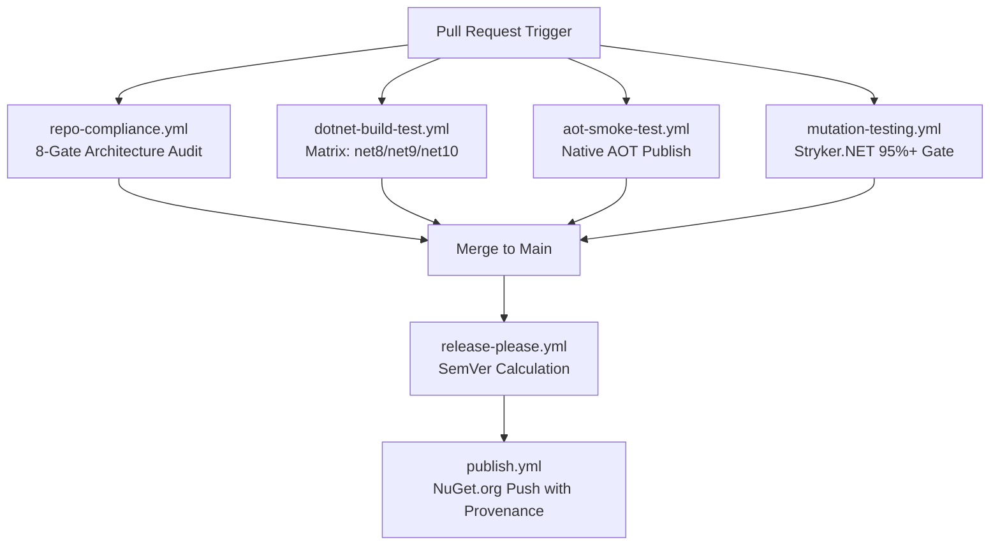

# CI/CD Automation Pipelines & Quality Verification

## 1. Pipeline Overview
The CI/CD architecture in `.github/workflows/` enforces a multi-layered verification strategy across every pull request and release:

---

## 2. Active Quality Workflows

1. **`repo-compliance.yml`**: Runs `./scripts/verify-compliance.ps1` to enforce kebab-case naming, zero `[Obsolete]` usages, single-type-per-file, and canonical MIT headers.
2. **`dotnet-build-test.yml`**: Builds the solution under `TreatWarningsAsErrors=true`, runs 720+ unit tests across multi-targeted frameworks (.NET 8, 9, 10), and uploads coverage to Codecov.
3. **`aot-smoke-test.yml`**: Publishes the standalone `AotSmokeTest` binary with `PublishAot=true` to verify trimming correctness.
4. **`mutation-testing.yml`**: Runs Stryker.NET mutation testing enforcing strict thresholds (Break: 95%, Low: 98%, High: 100%).
5. **`publish.yml`**: Packs all packages with deterministic strong naming (`EricksonLopez.snk`), generates Sigstore build provenance attestations, and publishes to NuGet.org.
