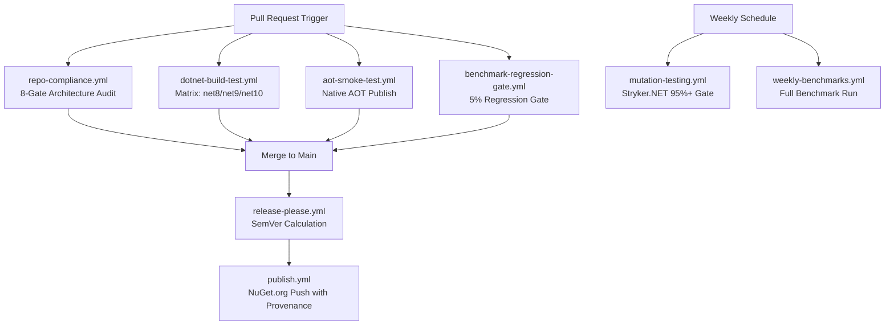

# CI/CD Automation Pipelines & Quality Verification

## 1. Pipeline Overview
The CI/CD architecture in `.github/workflows/` enforces a multi-layered verification strategy across every pull request and release:

> **Note:** Mutation testing (`mutation-testing.yml`) runs on a **weekly schedule** (Monday 04:00 UTC) and via `workflow_dispatch` — it does **not** run on pull requests due to CI duration constraints.

---

## 2. Active Quality Workflows

1. **`repo-compliance.yml`**: Runs `./scripts/verify-compliance.ps1` to enforce kebab-case naming, zero `[Obsolete]` usages, single-type-per-file, and canonical MIT headers.
2. **`dotnet-build-test.yml`**: Builds the solution under `TreatWarningsAsErrors=true`, runs the full test suite across multi-targeted frameworks (.NET 8, 9, 10), and uploads coverage to Codecov.
3. **`aot-smoke-test.yml`**: Publishes the standalone `AotSmokeTest` binary with `PublishAot=true` and `TreatWarningsAsErrors=true` to verify trimming correctness under `linux-x64`.
4. **`mutation-testing.yml`**: Runs Stryker.NET mutation testing in parallel across 7 packages enforcing strict thresholds (Break: <95%, Low: ≥98%, High: ≥100%). Triggered weekly and manually.
5. **`benchmark-regression-gate.yml`**: Compares PR benchmark results against baseline using `./scripts/verify-benchmark-gate.ps1` with a 5% regression threshold.
6. **`publish.yml`**: Packs all 7 packages with deterministic strong naming (`EricksonLopez.snk`), generates Sigstore build provenance attestations, and publishes to NuGet.org via OIDC.
