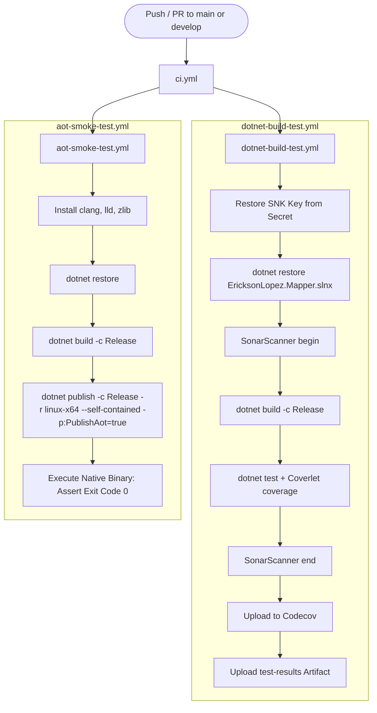

# CI/CD Pipeline

The `EricksonLopez.Mapper` repository employs an automated GitHub Actions DevOps architecture composed of **9 specialized workflows**. Continuous integration, NativeAOT smoke testing, multi-project mutation analysis, benchmark regression gates, and release publishing operate independently with explicit triggers and secrets management.

---

## 1. Workflow Catalog

| Workflow | File | Trigger | Responsibility |
|---|---|---|---|
| **CI Orchestrator** | `ci.yml` | `push`/`PR` → `main`, `develop` | Orchestrates parallel execution of `dotnet-build-test.yml` and `aot-smoke-test.yml`. |
| **Reusable Build & Test** | `dotnet-build-test.yml` | `workflow_call` | Reusable workflow: restores, builds, runs test suites, collects Coverlet coverage, and runs SonarCloud analysis. |
| **NativeAOT Smoke Test** | `aot-smoke-test.yml` | `push`/`PR`, `workflow_call`, `workflow_dispatch` | Compiles and executes `AotTest` under Linux using NativeAOT (`PublishAot=true`). |
| **Publish NuGet** | `publish.yml` | `push v*.*.*` tag, `workflow_dispatch` | Builds, tests, packs 7 packages, attests Sigstore provenance, publishes to NuGet.org via OIDC, and creates GitHub Release. |
| **Release Please** | `release-please.yml` | `push` → `main` | Parses Conventional Commits, creates release PRs, tags releases, and dispatches `publish.yml`. |
| **Mutation Testing** | `mutation-testing.yml` | Schedule Mon 04:00 UTC, `workflow_dispatch` | Runs Stryker.NET in a parallel matrix across **7 packages**: Core, Abstractions, Analyzers, DomainPrimitives, Generator, Mapster, Result. |
| **Benchmark Regression Gate** | `benchmark-regression-gate.yml` | PR → `main`, `develop` | Compares PR benchmark performance against baseline in `benchmarks/results/` (fails if delta > 10%). |
| **Benchmarks Baseline** | `benchmarks.yml` | `push` → `main`, `workflow_dispatch` | Captures benchmark baseline on `main` and commits results back to the branch. |
| **Weekly Deep Benchmarks** | `weekly-benchmarks.yml` | Schedule Sun 02:00 UTC, `workflow_dispatch` | Full non-abbreviated BenchmarkDotNet run across .NET 8, 9, and 10. |

---

## 2. Continuous Integration Flow



---

## 3. Package Release & Publishing Pipeline

```mermaid
flowchart LR
    Commit([Conventional Commit merged to main]) --> RP[release-please.yml]
    RP --> PRCheck{Release PR merged?}
    PRCheck -- No --> CreatePR[Create / Update Release PR]
    PRCheck -- Yes --> TagRelease[Create GitHub Release + git tag vX.Y.Z]
    TagRelease --> DispatchPublish[Dispatch publish.yml]

    subgraph "publish.yml"
        DispatchPublish --> PubRestore[dotnet restore & build Release]
        PubRestore --> PubTest[dotnet test — Publish Gate]
        PubTest --> PubPack[dotnet pack — all 7 packages]
        PubPack --> Attest[Sigstore Provenance Attestation]
        Attest --> OIDCLogin[NuGet Login via GitHub OIDC]
        OIDCLogin --> PushNuGet["dotnet nuget push --skip-duplicate"]
        PushNuGet --> CreateGhRelease[Publish GitHub Release Notes & Artifacts]
    end
```



---

## 4. Reusable Workflow: `dotnet-build-test.yml`

### Inputs

| Input Parameter | Type | Default | Description |
|---|---|---|---|
| `dotnet-version` | `string` | `10.0.x` | .NET SDK version to configure via `setup-dotnet`. |
| `test-filter` | `string` | `""` | Optional test filter expression passed to `dotnet test --filter`. |
| `test-project` | `string` | `""` | Specific test project path (runs all in solution if omitted). |
| `upload-coverage` | `boolean` | `true` | Controls whether coverage files are uploaded to Codecov. |
| `artifact-name` | `string` | `test-results` | Name of the uploaded test results artifact. |

### Secrets

| Secret Name | Required | Purpose |
|---|---|---|
| `SNK_KEY` | Optional | Base64-encoded `.snk` key for Strong Name assembly signing. |
| `CODECOV_TOKEN` | Optional | Codecov upload token for code coverage metric ingestion. |
| `SONAR_TOKEN` | Optional | SonarCloud token for static code quality analysis. |

---

## 5. NativeAOT Smoke Test: `aot-smoke-test.yml`

This workflow validates that `IsAotCompatible=true` is physically enforced:
- **Runner**: `ubuntu-latest` with native prerequisites (`clang`, `lld`, `zlib1g-dev`).
- **SDK Version**: `8.0.x` — intentionally pinned to validate `net8.0` TFM backward-compatibility. The AotTest project targets `net8.0`, `net9.0`, and `net10.0`; the `8.0.x` SDK is sufficient and produces the fastest CI feedback for the lowest LTS baseline.
- **Publish Configuration**:
  ```bash
  dotnet publish tests/EricksonLopez.Mapper.AotTest/EricksonLopez.Mapper.AotTest.csproj \
    --configuration Release \
    --runtime linux-x64 \
    --self-contained \
    -p:TreatWarningsAsErrors=true \
    -p:WarningLevel=5 \
    --output ./aot-output
  ```
- **Hard Gate**: `DOTNET_EnableAotCompilationWarningsAsErrors=true` ensures any `IL2026` (RequiresUnreferencedCode) or `IL3050` (RequiresDynamicCode) trim warning fails the build.
- **Execution**: The resulting native Linux ELF binary `./aot-output/EricksonLopez.Mapper.AotTest` is executed directly to verify zero runtime initialization faults.

---

## 6. Mutation Testing Matrix: `mutation-testing.yml`

Stryker.NET runs across **7 packages** in a parallel matrix:

| Matrix Target | Matrix Name | Config File (repo root) |
|---|---|---|
| **Core** | `Core` | `stryker-config.json` |
| **Abstractions** | `Abstractions` | `stryker-abstractions-config.json` |
| **Analyzers** | `Analyzers` | `stryker-analyzers-config.json` |
| **DomainPrimitives** | `DomainPrimitives` | `stryker-domainprimitives-config.json` |
| **Generator** | `Generator` | `stryker-generator-config.json` |
| **Mapster** | `Mapster` | `stryker-mapster-config.json` |
| **Result** | `Result` | `stryker-result-config.json` |

> **Note:** All Stryker configuration files are located at the **repository root**, not within individual `src/` project directories.

- **Trigger**: Weekly schedule (Monday 04:00 UTC) and `workflow_dispatch` — does NOT run on pull requests.
- **Mutation Level**: Configurable via `workflow_dispatch` input (`Basic` / `Standard` / `Advanced`). Default: `Standard`.
- **Thresholds** (single source of truth in each `stryker-*.json`): High ≥100%, Low ≥98%, Break <95%.
- **Result Aggregation**: A `mutation-gate-summary` job collects per-package JSON summaries, posts a consolidated markdown table to `GITHUB_STEP_SUMMARY`, and publishes a commit status (`mutation-testing/stryker`) used by the publish pipeline's `verify-mutation-gate.js` quality gate.

---

## 7. Benchmark Regression Gate: `benchmark-regression-gate.yml`

- **Trigger**: Pull requests touching `src/**` or `benchmarks/**`.
- **Execution**: Runs BenchmarkDotNet against PR head with `--job short`.
- **Comparison Engine**: Python script parses JSON benchmark results against `benchmarks/results/` baseline on `main`.
- **Gate Failure**: Any benchmark exceeding the 10% regression threshold (`REGRESSION_THRESHOLD`) fails the build with a summary table in `GITHUB_STEP_SUMMARY`.

---

## 8. Supply Chain Security Architecture

| Security Control | Implementation Mechanism |
|---|---|
| **Strong Name Signing** | `EricksonLopez.snk` decoded ephemerally from `SNK_KEY` GitHub Secret; never stored in repository. |
| **OIDC Trusted Publishing** | `NuGet/login@v1` using short-lived GitHub OIDC tokens; zero static API keys. |
| **Sigstore Build Provenance** | `actions/attest-build-provenance@v2` signs and generates attestations for all 7 `.nupkg` artifacts. |
| **Automated Dependency Auditing** | `dependabot.yml` scans NuGet and GitHub Actions dependencies on scheduled intervals. |
