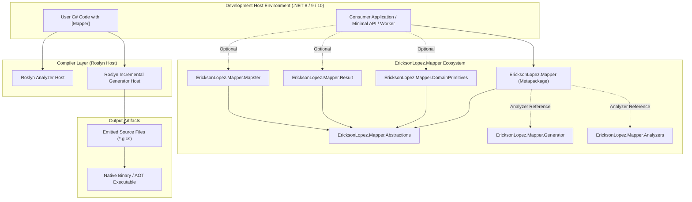
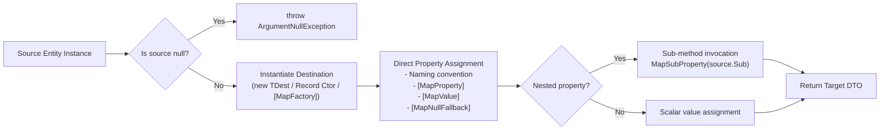
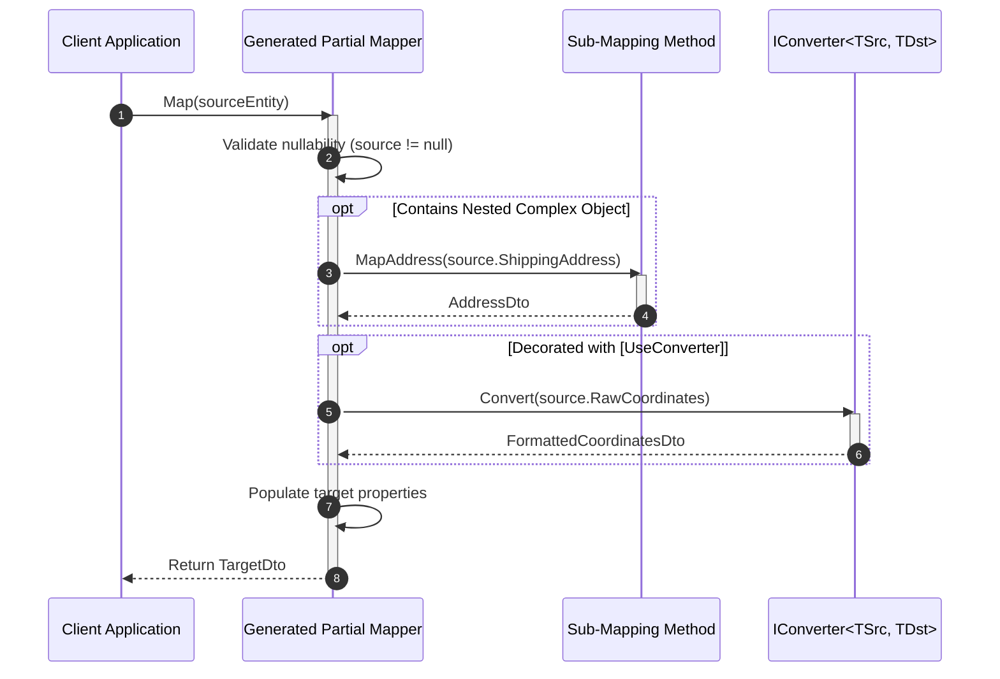
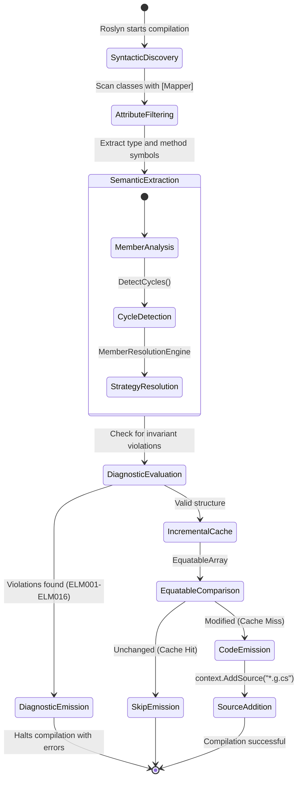
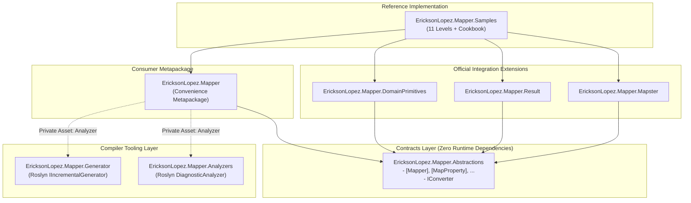
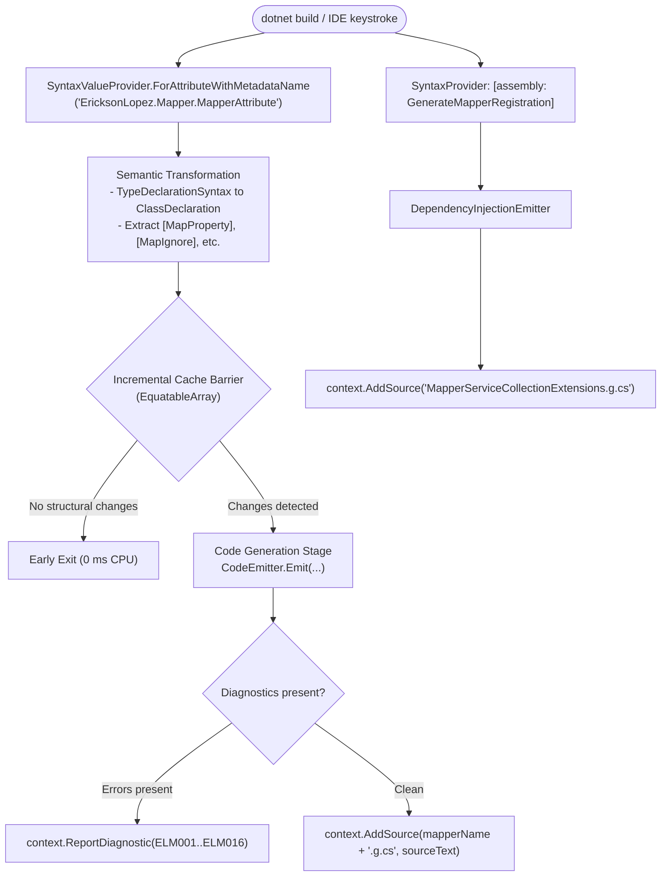
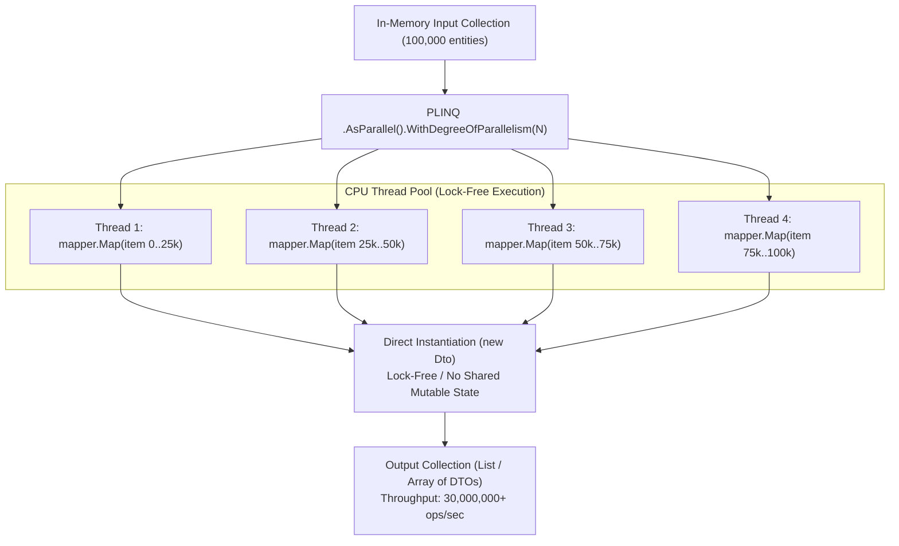
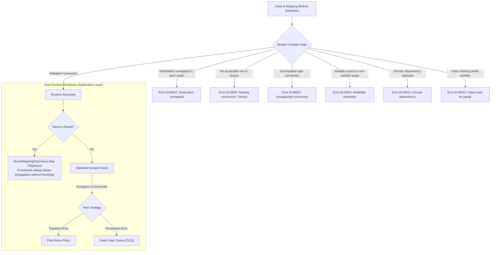

# Architecture & Technical Diagrams

> **Canonical Architectural Diagrams:** Derived strictly from the discovered architecture and implementation of `EricksonLopez.Mapper` (synchronous Roslyn Incremental Source Generator and NativeAOT-first design).

---

## 1. Ecosystem Architecture

---

## 2. Main Runtime Flow

---

## 3. Sequence Diagram (Mapping & Converters)

---

## 4. Compiler / Incremental Generator State Machine

---

## 5. Component Dependencies

---

## 6. Incremental Roslyn Pipeline

---

## 7. Batch & Concurrency Processing

---

## 8. Diagnostic Gate & Error Boundaries

