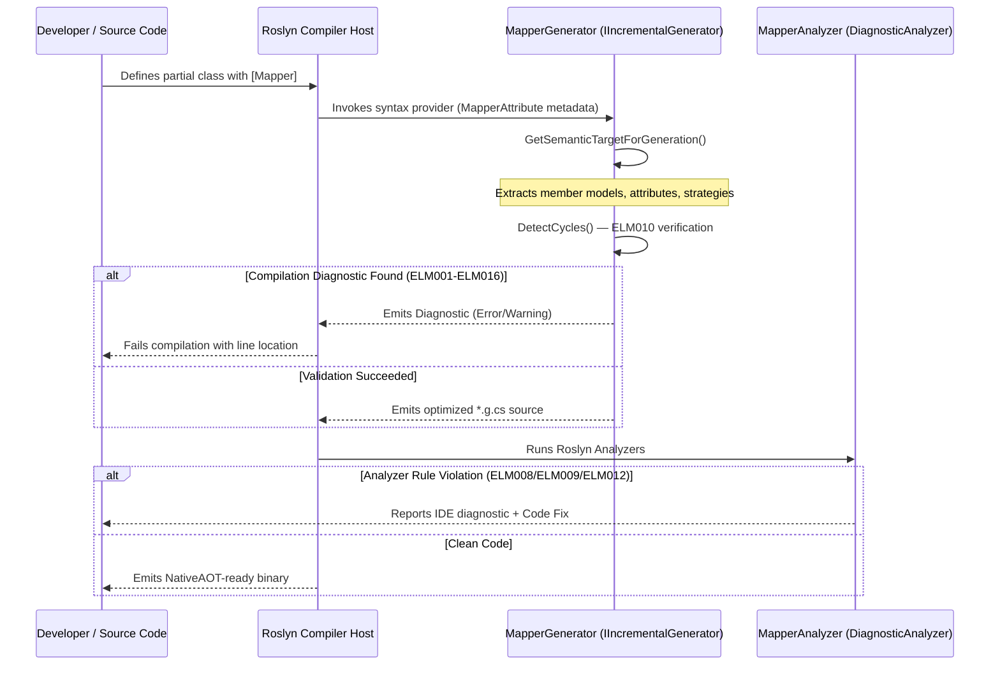
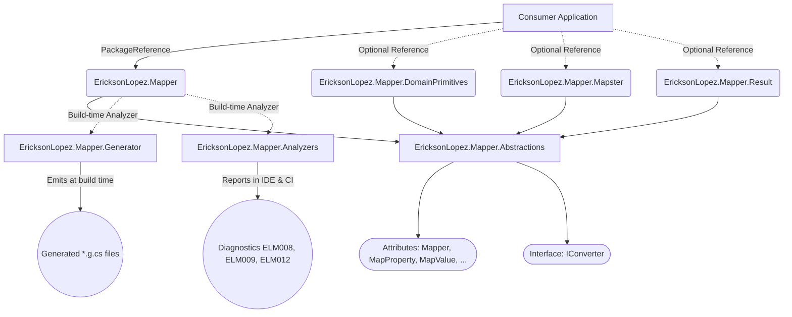
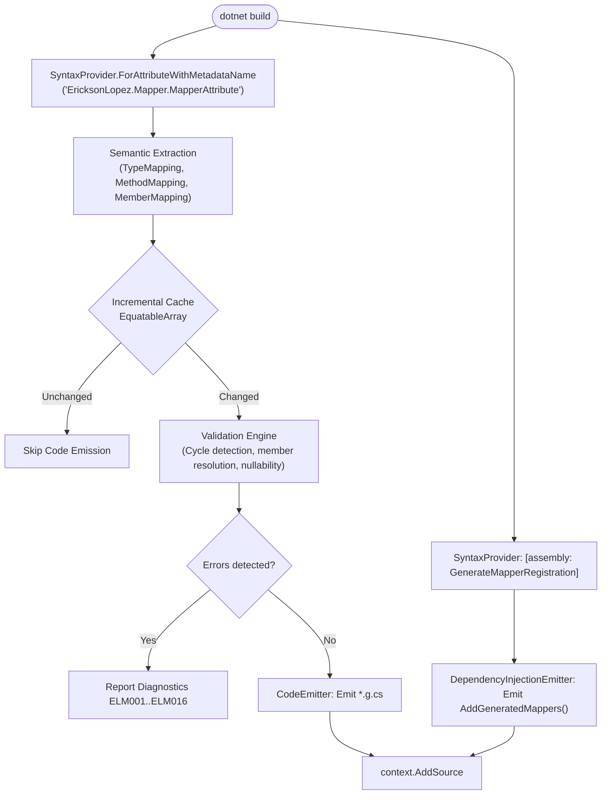
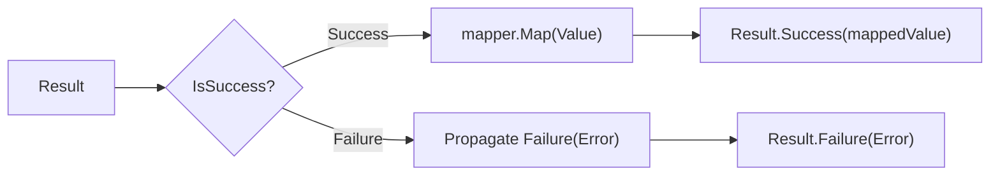
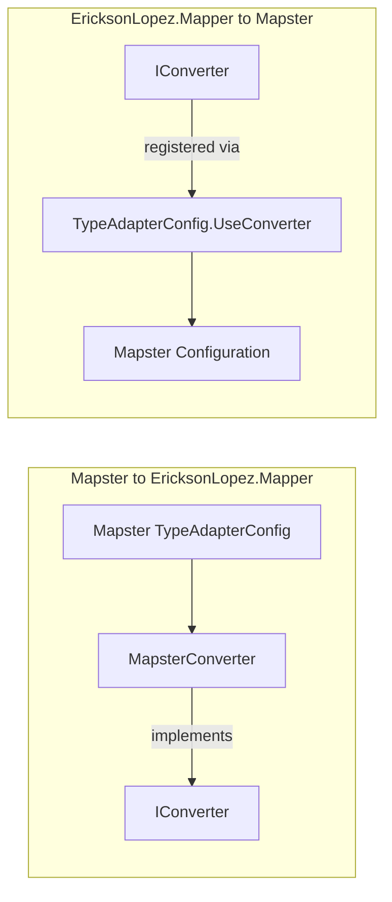
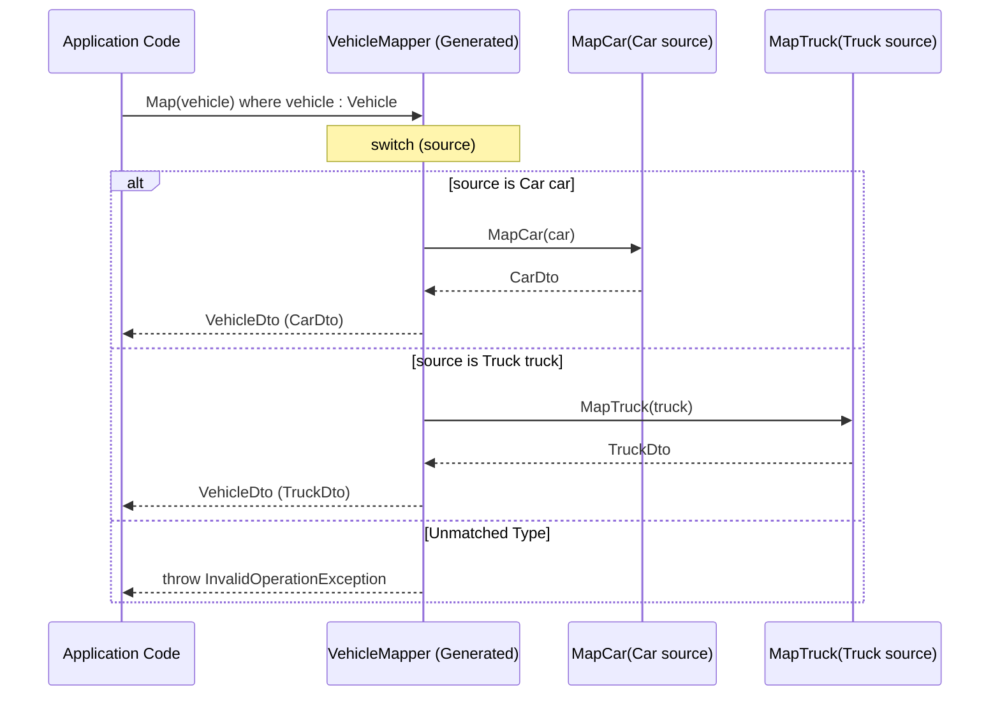
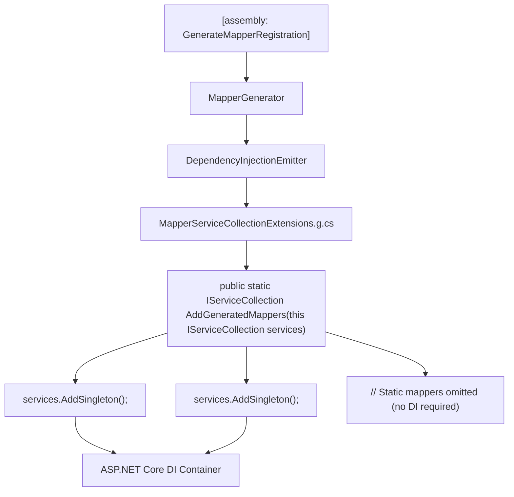

# Architecture & Flow Diagrams

This document contains visual diagrams documenting the architecture, compiler pipeline, runtime flows, extension bridges, and diagnostic paths of the **EricksonLopez.Mapper** ecosystem.

---

## 1. Build-Time Compilation Sequence



---

## 2. Ecosystem Component Dependencies



---

## 3. Incremental Generator Pipeline Architecture



---

## 4. Property Resolution & Conversion Strategy Decision Tree

```mermaid
flowchart TD
    DestMember[For each destination member] --> CheckIgnore{Has [MapIgnore]?}
    CheckIgnore -- Yes --> SkipMember[Exclude member]
    CheckIgnore -- No --> CheckValue{Has [MapValue]?}
    CheckValue -- Yes --> EmitLiteral[Emit literal C# expression]
    CheckValue -- No --> CheckPropertyOverride{Has [MapProperty] override?}

    CheckPropertyOverride -- Yes --> ResolveCustom[Search source by explicit custom name / deep path]
    CheckPropertyOverride -- No --> ResolveConvention[Search source by case-insensitive name]

    ResolveCustom --> MatchCheck{Found in source?}
    ResolveConvention --> MatchCheck

    MatchCheck -- No --> CheckStrict{StrictMapping == true?}
    CheckStrict -- Yes --> ELM001[Emit ELM001 Error: Unmapped Member]
    CheckStrict -- No --> SkipMember

    MatchCheck -- Yes --> TypeCompatibility{Are types compatible?}
    TypeCompatibility -- Same Primitive / Scalar --> DirectAssign[Emit Direct Assignment]
    TypeCompatibility -- Widening Numeric --> WideningAssign[Emit Implicit Widening]
    TypeCompatibility -- Narrowing Numeric --> NarrowingAssign[Emit Explicit Cast + ELM015 Warning]
    TypeCompatibility -- Enum matching --> EnumResolution[Emit Enum Strategy Cast / Switch]
    TypeCompatibility -- Temporal bridging --> TemporalAssign[Emit DateOnly/DateTime/Offset Conversion]
    TypeCompatibility -- Value Object --> VOWrap[Emit Wrap / Unwrap .Value]
    TypeCompatibility -- Collection target --> CollectionLoop[Emit Pre-sized for/foreach Loop]
    TypeCompatibility -- Dictionary target --> DictLoop[Emit KVP Iteration Loop]
    TypeCompatibility -- Sub-mapper exists --> SubMapperCall[Emit sub-mapper invocation]
    TypeCompatibility -- [UseConverter] present --> ConverterCall[Emit IConverter.Convert]
    TypeCompatibility -- Incompatible --> ELM003[Emit ELM003 Error: Unsupported Conversion]
```

---

## 5. Result<T> Railway-Oriented Pipeline (`EricksonLopez.Mapper.Result`)



---

## 6. Mapster Adapter Bridge (`EricksonLopez.Mapper.Mapster`)



---

## 7. Polymorphic Dispatch Execution Flow



---

## 8. Dependency Injection Synthesis & Registration


