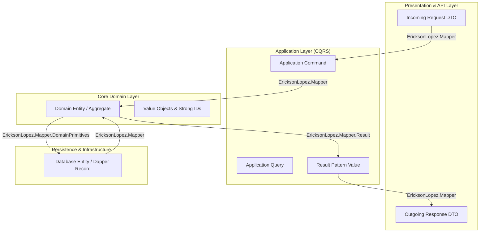

# Functional Domain Map & Mapping Topology

## 1. System Mapping Topology

---

## 2. Layer Responsibilities
- **Presentation $\leftrightarrow$ Application**: Maps unvalidated JSON DTOs to strongly-typed command/query records.
- **Application $\leftrightarrow$ Domain**: Converts primitives into encapsulated Domain Primitives and Value Objects.
- **Domain $\leftrightarrow$ Persistence**: Maps entities to flat Dapper/PostgreSQL data structures.
