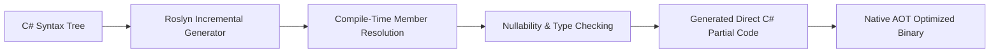

# EricksonLopez.Mapper — Showcase Specification & Architectural Reference

> **Official Reference Implementation and Living Architecture Specification**  
> Target: **.NET 10 / C# 14** · Metaprogramming: **Roslyn Incremental Source Generation** · Memory Model: **Zero-Allocation / Native AOT**  
> Status: **100% Synchronized with Public API & Runtime Verified**

---

## 1. Solution Architecture & Package Segregation

The `EricksonLopez.Mapper.slnx` solution consists of specialized, orthogonal assemblies ensuring strict boundary separation and trimming compatibility:

| Project Path | Category | Architectural Responsibility | Target Framework |
|---|---|---|---|
| `src/EricksonLopez.Mapper` | **Core Package** | Main package referencing abstractions and generators. Entry point for consumers. | `net8.0;net9.0;net10.0` |
| `src/EricksonLopez.Mapper.Abstractions` | **Contracts** | Pure declarative attributes (`[Mapper]`, `[Map]`, `[MapProperty]`, `[MapIgnore]`, `[MapFactory]`, `[MapNullFallback]`, `[MapEnum]`, `[MapDerived]`) and interfaces (`IConverter<TSource, TDestination>`). Zero dependencies. | `net8.0;net9.0;net10.0` |
| `src/EricksonLopez.Mapper.Generator` | **Compiler Tooling** | Roslyn Incremental Generator analyzing syntax trees and emitting static C# mapping methods. | `netstandard2.0` |
| `src/EricksonLopez.Mapper.Analyzers` | **Quality Gates** | Roslyn Diagnostic Analyzers (`ELM001` - `ELM016`) enforcing AOT invariants, partial modifiers, and no-reflection rules. | `netstandard2.0` |
| `src/EricksonLopez.Mapper.DomainPrimitives` | **Integrations** | Zero-allocation converters for `DomainPrimitives` and strongly-typed identifiers. | `net8.0;net9.0;net10.0` |
| `src/EricksonLopez.Mapper.Result` | **Integrations** | Extension methods and mapping pipeline adapters for the `Result<T>` pattern. | `net8.0;net9.0;net10.0` |
| `src/EricksonLopez.Mapper.Mapster` | **Migration** | Type adapters and compatibility bridges for migrating legacy Mapster configurations. | `net8.0;net9.0;net10.0` |
| `samples/EricksonLopez.Mapper.Samples` | **Showcase** | Executable living documentation containing progressive sample levels from 00 to 10. | `net10.0` |
| `benchmarks/EricksonLopez.Mapper.Benchmarks` | **Performance** | BenchmarkDotNet micro-benchmarks comparing throughput and allocations against AutoMapper, Mapster, and Mapperly. | `net10.0` |

---

## 2. Declarative Public API & Attributes

### 2.1 Attribute Reference

| Attribute | Target | Responsibility |
|---|---|---|
| `[Mapper]` | `class`, `struct` | Declares a partial mapping class to be processed by the Roslyn Incremental Generator. |
| `[Map]` | `method` | Explicitly annotates a partial method as a mapping target. |
| `[MapProperty(target, source)]` | `method` | Customizes property binding from a source property path or static expression. |
| `[MapIgnore(member)]` | `method` | Instructs the generator to omit the specified destination property from mapping. |
| `[MapFactory(methodName)]` | `method` | Specifies a static factory method used to instantiate the destination instance. |
| `[MapConstructor(...types)]` | `method` | Disambiguates constructor selection by explicitly declaring target constructor parameter types. |
| `[MapNullFallback(member, fallback)]` | `method` | Provides a fallback value or expression when a nullable source member evaluates to null. |
| `[MapEnum(sourceVal, destVal)]` | `method` | Explicitly maps differing enum member names or ordinal values. |
| `[MapDerived(sourceType, destType)]` | `method` | Defines polymorphic subtype mapping branches for abstract base classes and interfaces. |
| `[UseConverter(typeof(TConverter))]` | `class`, `method` | Registers custom `IConverter<TSource, TDestination>` implementations for property conversions. |
| `[MapperDefaults]` | `class`, `assembly` | Sets global mapper configuration options (case sensitivity, enum parsing fallbacks, null handling). |

---

## 3. Core Architectural Patterns

### 3.1 Zero Reflection & Zero Runtime Dynamic Dispatch
Unlike legacy reflection-based mappers that inspect `System.Type` and call `MethodInfo.Invoke` on every request, `EricksonLopez.Mapper` resolves all types and members at compile time. The generated code consists of direct C# property assignments and constructor invocations identical to handwritten code.

### 3.2 Polymorphic Dispatch without Dynamic Type Scans
Polymorphic hierarchies (`[MapDerived]`) are compiled into explicit C# pattern-matching switch expressions (`source switch { ConcreteA a => MapA(a), ... }`), entirely avoiding `GetType()` reflection and table lookups.
