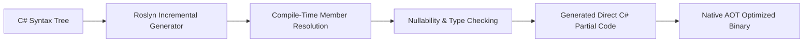

# EricksonLopez.Mapper — Showcase Specification & Architectural Reference

> **Official Reference Implementation and Living Architecture Specification**  
> Target: **.NET 8 / .NET 9 / .NET 10 / C# 14** · Metaprogramming: **Roslyn Incremental Source Generation** · Memory Model: **Zero-Allocation / Native AOT**  
> Status: **100% Synchronized with Public API (`PublicAPI.Shipped.txt`) & Runtime Verified**

---

## 1. Solution Architecture & Package Segregation

The `EricksonLopez.Mapper.slnx` solution consists of specialized, orthogonal assemblies ensuring strict boundary separation and trimming compatibility:

| Project Path | Category | Architectural Responsibility | Target Framework |
|---|---|---|---|
| `src/EricksonLopez.Mapper` | **Core Metapackage** | Main package referencing `EricksonLopez.Mapper.Abstractions` and analyzers/generators. Direct consumer entry point. | `net8.0;net9.0;net10.0` |
| `src/EricksonLopez.Mapper.Abstractions` | **Contracts** | Pure declarative attributes (`[Mapper]`, `[MapProperty]`, `[MapIgnore]`, `[MapIgnoreSource]`, `[MapperIgnore]`, `[MapValue]`, `[MapNullFallback]`, `[MapFactory]`, `[MapDerivedType]`, `[MapEnumValue]`, `[EnumMappingStrategy]`, `[UseConverter]`, `[ValueObject]`, `[MapperDefaults]`, `[GenerateMapperRegistration]`) and interfaces (`IConverter<TSource, TDestination>`). Zero dependencies. | `net8.0;net9.0;net10.0;netstandard2.0` |
| `src/EricksonLopez.Mapper.Generator` | **Compiler Tooling** | Roslyn Incremental Generator analyzing syntax trees and emitting static C# mapping methods and DI extension methods. | `netstandard2.0` |
| `src/EricksonLopez.Mapper.Analyzers` | **Quality Gates** | Roslyn Diagnostic Analyzers (`ELM001` - `ELM016`) enforcing AOT invariants, partial modifiers, and no-reflection rules. | `netstandard2.0` |
| `src/EricksonLopez.Mapper.DomainPrimitives` | **Integrations** | Zero-allocation converters for `DomainPrimitives` and strongly-typed identifiers. | `net8.0;net9.0;net10.0` |
| `src/EricksonLopez.Mapper.Result` | **Integrations** | Functional extension methods for the `Result<T>` pattern (synchronous, `Task`, `ValueTask`, and collection mapping). | `net8.0;net9.0;net10.0` |
| `src/EricksonLopez.Mapper.Mapster` | **Migration** | Type adapters and compatibility bridges for interoperability with Mapster. | `net8.0;net9.0;net10.0` |
| `samples/EricksonLopez.Mapper.Samples` | **Showcase** | Executable living reference implementation demonstrating progressive sample levels from 00 to 10. | `net10.0` |
| `benchmarks/EricksonLopez.Mapper.Benchmarks` | **Performance** | BenchmarkDotNet micro-benchmarks comparing throughput and allocations against manual mapping, AutoMapper, Mapster, and Mapperly. | `net10.0` |

---

## 2. Declarative Public API & Attributes

Every attribute in this table is verified against `PublicAPI.Shipped.txt`.

### 2.1 Attribute Reference

| Attribute | Target | Responsibility |
|---|---|---|
| `[Mapper]` | `class`, `interface` | Declares a partial class or interface whose partial methods are implemented by the Roslyn Incremental Generator. Property: `StrictMapping` (default `true`). |
| `[MapProperty(sourceName, destinationName)]` | `method` | Customizes property binding between different member names or deep dot-notation property paths. |
| `[MapIgnore(destinationName)]` | `method` | Explicitly excludes the specified destination property from mapping, suppressing `ELM001` in strict mode. |
| `[MapIgnoreSource(sourceName)]` | `method` | Explicitly excludes the specified source property from participating in member resolution. |
| `[MapperIgnore]` | `property`, `field` | Excludes a member from all mapping operations when placed directly on the model member. |
| `[MapValue(destinationName, valueExpression)]` | `method` | Assigns a constant or computed C# expression directly to a destination property or constructor parameter. |
| `[MapNullFallback(destinationName, fallbackExpression)]` | `method` | Emits a literal C# expression as fallback when a nullable source member is null and destination is non-nullable. |
| `[MapFactory(methodName)]` | `method` | Instructs the generator to instantiate the destination type by calling a static factory method on the target type. |
| `[MapDerivedType(sourceType, targetType)]` | `method` | Registers a derived source type and its target type for compile-time polymorphic dispatch (pattern-matching switch). |
| `[EnumMappingStrategy(strategy)]` | `class`, `interface`, `method` | Configures enum member matching strategy (`ByName` vs `ByValue`) and `IgnoreCase` sensitivity. |
| `[MapEnumValue(source, target)]` | `method` | Explicitly maps an individual source enum member to a destination enum member when names differ. |
| `[UseConverter(Type)]` / `[UseConverter(fieldName)]` | `method` | Specifies a custom `IConverter<TSource, TDestination>` type or an instance field holding a converter. |
| `[ValueObject]` | `class`, `struct` | Marks a type as a Value Object to enable automatic wrap/unwrap of its inner primitive value. |
| `[assembly: MapperDefaults]` | `assembly` | Specifies assembly-wide defaults for `StrictMapping`, `EnumMappingStrategy`, and `EnumIgnoreCase`. |
| `[assembly: GenerateMapperRegistration]` | `assembly` | Emits an `AddGeneratedMappers(this IServiceCollection)` extension method for automated DI registration. |

---

## 3. Core Architectural Patterns

### 3.1 Zero Reflection & Zero Runtime Dynamic Dispatch
Unlike legacy reflection-based mappers that inspect `System.Type` and call `MethodInfo.Invoke` on every request, `EricksonLopez.Mapper` resolves all types and members at compile time. The generated code consists of direct C# property assignments and constructor invocations identical to handwritten code.

### 3.2 Polymorphic Dispatch without Dynamic Type Scans
Polymorphic hierarchies (`[MapDerivedType]`) are compiled into explicit C# pattern-matching switch expressions (`source switch { ConcreteA a => MapA(a), ... }`), entirely avoiding `GetType()` reflection and table lookups.
