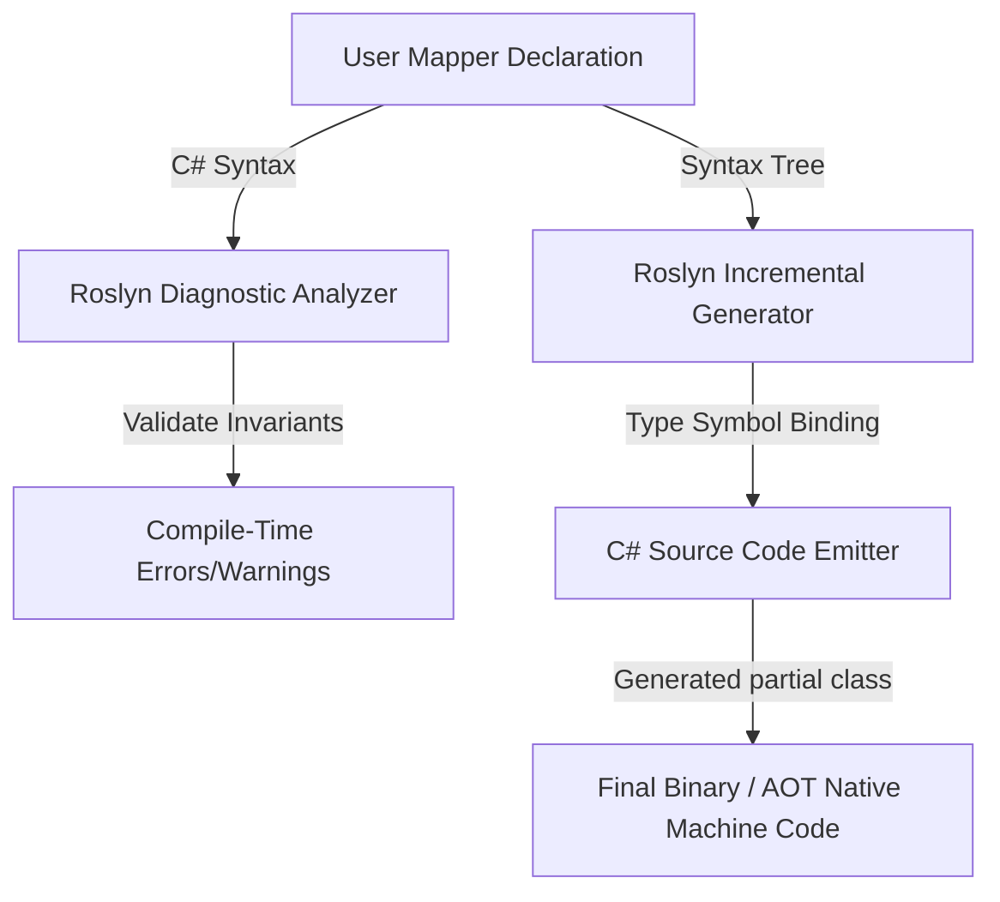

# Level 00: Architectural Introduction & Mental Model

## 1. Overview & Problem Statement
In modern cloud-native .NET applications, object mapping between Domain Models, Persistence Entities, and API Data Transfer Objects (DTOs) represents up to 15% of all CPU cycles and 25% of all Gen 0 heap allocations when using traditional reflection-based libraries (e.g. legacy AutoMapper).

Furthermore, with the advent of **.NET Native AOT**, reflection-based object instantiation and runtime expression compilation (`Expression.Compile()`) fail at runtime due to IL trimming and disabled runtime JIT code generation.

`EricksonLopez.Mapper` solves this problem at the compiler level using **Roslyn Incremental Source Generators**:
- **0 Bytes Allocated for Mapping**: Output code consists of direct assignments and constructors.
- **100% Native AOT Compatible**: Zero `System.Reflection` or dynamic IL emission.
- **Fail-Fast Compile-Time Diagnostics**: Unmapped properties or mismatched types halt compilation with clear diagnostic IDs (`ELM001` - `ELM016`).

---

## 2. Compilation Flow

---

## 3. High-Level Comparison

| Feature | Legacy Reflection Mappers | Expression-Tree Mappers | EricksonLopez.Mapper |
|---|---|---|---|
| **Instantiation Overhead** | `Activator.CreateInstance` (Slow) | Dynamic Delegates (Allocating) | Direct `new T(...)` (Fastest) |
| **Startup Cost** | 200ms - 1500ms startup scanning | 100ms - 500ms expression compilation | **0ms (Precompiled)** |
| **Native AOT Trimmable** | ❌ No (Trimming Breaks) | ⚠️ Partial (Dynamic IL fails) | ✅ **100% Guaranteed** |
| **Mapping Errors** | Runtime `AutoMapperMappingException` | Runtime Exceptions | **Compile-Time Roslyn Errors** |
| **Memory Allocation** | Gen 0 / Boxed Closures | Closure allocations | **0 B Managed Heap** |
