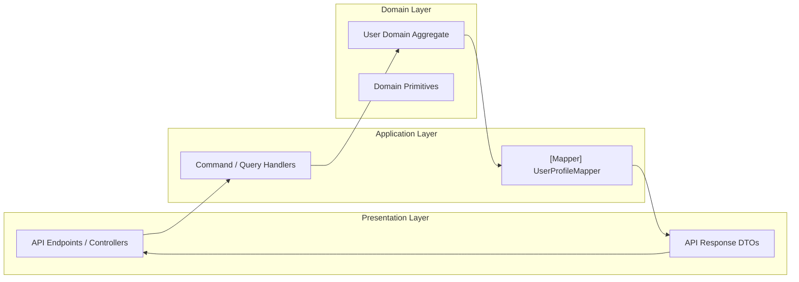

# Level 10 — Enterprise Clean Architecture

> **Showcase Source:** [`Level10_Architecture/ArchitectureDemo.cs`](file:///d:/DevData/ericksonlopez.dev/dotnet-mapper/samples/EricksonLopez.Mapper.Samples/Level10_Architecture/ArchitectureDemo.cs)  
> **Complexity Level:** Advanced / Architectural  
> **API Surface Covered:** Clean Architecture Boundaries, DDD Anti-Corruption Layers, `[MapIgnoreSource]`

---

## 1. Mapping at Clean Architecture Boundaries

In enterprise architectures governed by Clean Architecture and Domain-Driven Design (DDD) principles:
- **The Domain Layer** is completely independent and agnostic of infrastructure, frameworks, and external tiers.
- **The Application Layer** hosts use-case command/query contracts and DTO definitions.
- **Mappers** are strategically declared in the **Application Layer** or **Presentation Layer** to translate between Domain entities and transport contracts.



---

## 2. Boundary Protection with `[MapIgnoreSource]`

A critical architectural responsibility is ensuring that sensitive domain entity state (security stamps, password hashes, concurrency tokens) is never leaked into external public contracts:

```csharp
public class UserProfileEntity
{
    public Guid Id { get; set; }
    public string Email { get; set; } = string.Empty;
    public string PasswordHash { get; set; } = string.Empty;
    public string ConcurrencyStamp { get; set; } = string.Empty;
}

public class UserProfileDto
{
    public Guid Id { get; set; }
    public string Email { get; set; } = string.Empty;
}

[Mapper]
public partial class UserProfileMapper
{
    [MapIgnoreSource(nameof(UserProfileEntity.PasswordHash))]
    [MapIgnoreSource(nameof(UserProfileEntity.ConcurrencyStamp))]
    public partial UserProfileDto Map(UserProfileEntity source);
}
```

The Roslyn generator entirely omits `PasswordHash` and `ConcurrencyStamp` from the emitted mapping assignments, ensuring public projection integrity.
