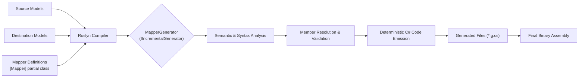
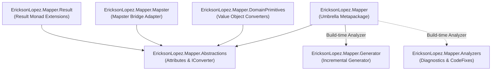

# System Overview

## 1. Purpose

`EricksonLopez.Mapper` is a compile-time Object-to-Object mapping ecosystem for .NET, implemented exclusively as a **Roslyn Incremental Source Generator**. Its primary mission is to eliminate runtime reflection, dynamic IL emission (`Reflection.Emit`), and startup configuration discovery — the core bottlenecks and safety risks of traditional mapping libraries like AutoMapper.

By executing the entire mapping synthesis during compilation, it guarantees:

- **Zero Startup Overhead**: No runtime assembly scanning or profile compilation during service initialization.
- **Native AOT & Trimming First**: 100% compatible with Ahead-of-Time compilation (`PublishAot=true`) and aggressive IL trimming.
- **Compile-Time Verification**: Unmapped properties, type mismatches, and cyclic references fail compilation immediately (`ELM001`–`ELM016`).
- **Physical Minimum Overhead**: Emits direct property assignment statements statistically indistinguishable from hand-written C# code.

---

## 2. The Problem with Runtime Mapping

Traditional .NET object mappers rely on reflection or runtime expression tree compilation (`Expression.Compile`) to discover and execute mappings. This introduces severe production tradeoffs:

| Problem in Traditional Mappers | Architectural Consequence | How EricksonLopez.Mapper Solves It |
|---|---|---|
| Runtime Reflection & `IL.Emit` | Incompatible with NativeAOT; triggers trim warnings (`IL2026`, `IL3050`) | 100% compile-time C# code generation via Roslyn |
| Startup Profile Scanning | Adds noticeable latency to serverless cold starts and container boot | Zero startup initialization; pure static methods or singletons |
| Runtime Configuration Errors | Mismatches discovered via runtime exceptions in production | Immediate compilation errors (`ELM001`–`ELM016`) |
| Unsafe Encapsulation Bypass | Violates DDD invariants by mutating unexposed private members | Respects public contracts, parameterized constructors, and `[MapFactory]` |
| Mutating Existing Instances | Causes race conditions and breaks immutability guarantees | Enforces functional transformations creating clean new instances |

---

## 3. High-Level Processing Model

---

## 4. Ecosystem Packages

The repository is structured into 7 focused packages:

For deeper architectural details, see [architecture.md](architecture.md) and [architecture-guide.md](architecture-guide.md).
